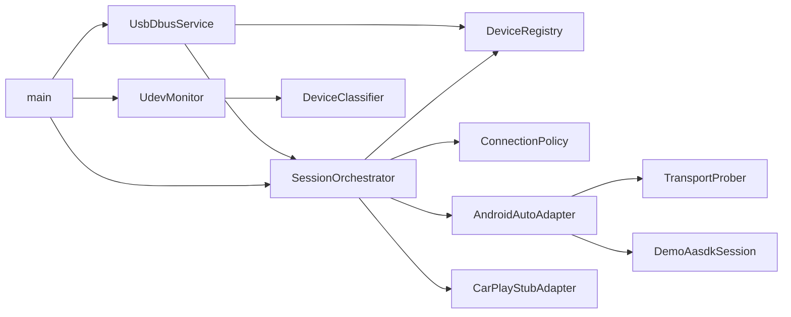

# Giải thích các function / API — usb-manager

Namespace: `usb_manager`. Đọc kèm [READING_ROADMAP.md](READING_ROADMAP.md) và [SEQUENCES.md](SEQUENCES.md).

---

## 1. `Types.hpp` — mô hình dữ liệu

Không phải function “xử lý”, nhưng là **ngôn ngữ chung** của toàn daemon.

| Symbol | Ý nghĩa |
|--------|---------|
| `DeviceType` | Phân loại thiết bị: `Android`, `IPhone`, `MassStorage`, `Hid`, `Unknown` |
| `DeviceState` | Vòng đời thiết bị trên USB: `Enumerating` → `Classified` → `Probing` → `Ready` → `Connecting` → `Active` … |
| `SessionMode` | Loại session: `AndroidAuto`, `CarPlay`, `Storage`, `None` |
| `SessionState` | Vòng đời session: `Idle` / `Starting` / `Active` / `Stopping` / `Failed` |
| `UsbDeviceInfo` | Snapshot 1 device (VID/PID, serial, state, `aoapSupported`, `netInterface`, …) |
| `SessionInfo` | Snapshot session đang theo dõi (`deviceId`, mode, state, `reason`) |
| `toString(...)` | Đưa enum ra chuỗi (log + D-Bus) |
| `sessionModeFromString` | Parse `"android_auto"` / `"carplay"` / `"storage"` từ D-Bus |

**Ghi nhớ:** `DeviceState` = trạng thái **thiết bị USB**; `SessionState` = trạng thái **projection session**.

---

## 2. `UdevMonitor` — hotplug (P0)

File: `hotplug/UdevMonitor.{hpp,cpp}`

| Function | Vai trò |
|----------|---------|
| `setCallback(cb)` | Đăng ký handler nhận `HotplugEvent` (Add/Remove/Change) |
| `start()` | Tạo `udev` + `udev_monitor` netlink, filter `subsystem=usb`, `devtype=usb_device` |
| `stop()` | Hủy monitor / context |
| `pollOnce(timeoutMs)` | `select` trên fd monitor → `udev_monitor_receive_device` → fill `UsbDeviceInfo` → classify → gọi callback |
| `enumerateExisting()` | Quét thiết bị đang cắm lúc boot daemon, emit Add giả lập |
| `fd()` | File descriptor (phục vụ tích hợp event loop khác nếu cần) |

**Helpers nội bộ (anonymous namespace trong .cpp)**

| Helper | Vai trò |
|--------|---------|
| `parseHexId` | `"18d1"` → `0x18d1` |
| `makeDeviceId` | id ổn định `usb-<busnum>-<devnum>` |
| `fillFromUdev` | Đọc properties/sysfs → `UsbDeviceInfo` |
| `isUsbDevice` | Chỉ nhận `usb` + `usb_device` (bỏ interface con) |

---

## 3. `DeviceClassifier` — phân loại (P0)

File: `classify/DeviceClassifier.{hpp,cpp}`

| Function | Vai trò |
|----------|---------|
| `classify(info)` | Trả về `DeviceType` từ VID/PID + manufacturer/product + `ID_USB_INTERFACES` |
| `enrich(info)` | Gán `info.type = classify(info)` (dùng ngay sau khi fill từ udev) |
| `isApple(vid)` | `vid == 0x05ac` → candidate iPhone/CarPlay |
| `looksLikeAndroid` | Google/Samsung/… VID, chuỗi “Android”/“MTP”, interface `:ff` |
| `looksLikeMassStorage` | Interface class `08` hoặc tên “USB Disk” |
| `looksLikeHid` | Interface class `03` |

**Thứ tự ưu tiên trong `classify`:** Apple → Android → MassStorage → Hid → Unknown.

---

## 4. `DeviceRegistry` — sổ đăng ký thiết bị (P1)

File: `registry/DeviceRegistry.{hpp,cpp}`

| Function | Vai trò |
|----------|---------|
| `setChangeCallback(cb)` | Mỗi lần registry đổi → notify (thường emit D-Bus `DeviceChanged`) |
| `upsert(device, reason)` | Thêm/cập nhật theo `deviceId` |
| `remove(deviceId, reason)` | Xóa khỏi map |
| `get(deviceId)` | Tra cứu 1 device (`optional`) |
| `list()` | Tất cả device hiện có |
| `updateState(id, state, reason)` | Đổi `DeviceState` |
| `updateFields(id, mutator, reason)` | Đổi nhiều field (AOAP/NCM flags…) qua lambda |

Thread-safe bằng `mutex` nội bộ.

---

## 5. `ConnectionPolicy` — luật kết nối (P4)

File: `policy/ConnectionPolicy.{hpp,cpp}`

| Function | Vai trò |
|----------|---------|
| `setAllowlistEnabled(bool)` | Bật/tắt lọc theo serial |
| `allowSerial(serial)` | Thêm serial vào allowlist |
| `clearAllowlist()` | Xóa list |
| `preferredMode(device)` | Android→AA, iPhone→CarPlay, MassStorage→Storage |
| `canStart(device, mode, active)` | Trả `PolicyDecision{allowed, reason}` |

**Luật quan trọng trong `canStart`**
- Mode không hợp lệ / device Failed|Ignored → reject
- Allowlist bật mà serial không khớp → `not_in_allowlist`
- Đã có session AA/CarPlay Active trên device khác → `exclusive_session_active:…`
- Mode không khớp `DeviceType` → `type_mismatch_*`

---

## 6. `TransportProber` — AOAP / NCM (P2)

File: `aoap/TransportProber.{hpp,cpp}`

| Function | Vai trò |
|----------|---------|
| `probeAoap(device)` | `libusb` control transfer `GET_PROTOCOL` (bmRequestType `0xC0`, bRequest `51`). Nếu đã ở accessory PID Google → coi như supported |
| `probeNcm(device)` | Duyệt `/sys/class/net`, tìm iface gắn USB tree hoặc driver `cdc_ncm` / `rndis_host` / `cdc_ether` |

Không chuyển mode phone sang AOAP (START=53) trong prototype — chỉ **detect/log**.

---

## 7. Adapters — biên projection

### `IProjectionAdapter`

| Method | Vai trò |
|--------|---------|
| `mode()` | `AndroidAuto` hoặc `CarPlay` |
| `name()` | Tên debug |
| `probe(device)` | Kiểm tra transport / khả dụng trước session |
| `start(device)` / `stop(device)` | Bắt đầu / dừng stack projection |

### `IAasdkSession` / `DemoAasdkSession` (P3)

| Method | Vai trò |
|--------|---------|
| `start(device, errorOut)` | Demo: log mở Video/Audio/Input/Sensor channel (giả AASDK) |
| `stop()` | Đóng session demo |
| `isActive()` | Session demo đang chạy? |
| `name()` | `"DemoAasdkSession"` |

Thay bằng AASDK thật: xem [AASDK_INTEGRATION.md](AASDK_INTEGRATION.md).

### `AndroidAutoAdapter`

| Method | Vai trò |
|--------|---------|
| `probe` | Gọi `TransportProber` AOAP+NCM; nếu chưa có transport vẫn cho demo path khi `type==Android` |
| `start` / `stop` | Ủy quyền `IAasdkSession` |

### `CarPlayStubAdapter`

| Method | Vai trò |
|--------|---------|
| `probe` | Nhận Apple device, log `Available=false Reason=MFI_REQUIRED` |
| `start` | **Luôn fail** `MFI_REQUIRED` |
| `stop` | No-op thành công |
| `available()` / `unavailableReason()` | Contract cho HMI |

---

## 8. `SessionOrchestrator` — state machine (P1)

File: `session/SessionOrchestrator.{hpp,cpp}`

| Function | Vai trò |
|----------|---------|
| `setAndroidAutoAdapter` / `setCarPlayAdapter` | Gắn adapter |
| `setSessionChangeCallback` | Notify khi session đổi (D-Bus `SessionChanged`) |
| `onDeviceAdded` | Enumerating → Classified (hoặc Ignored) → `probeDevice` |
| `onDeviceRemoved` | Nếu đang Active → `stopSession` → Disconnecting → xóa registry |
| `probeDevice` | Probing → `adapter->probe` → Ready/Failed; AA thì **auto** `startSession`; CarPlay emit Failed `MFI_REQUIRED` |
| `startSession` | `policy.canStart` → Connecting → `adapter->start` → Active/Failed |
| `stopSession` | Stopping → `adapter->stop` → device Ready → session Idle |
| `activeSession` | Session đang không Idle (nếu có) |
| `transition` *(private)* | Đổi `DeviceState` + `registry.upsert` + log |
| `emitSession` *(private)* | Cập nhật `active_` + callback |
| `adapterFor` *(private)* | Mode → shared_ptr adapter |

---

## 9. `UsbDbusService` — IPC (P1)

File: `ipc/UsbDbusService.{hpp,cpp}`

| Function / method | Vai trò |
|-------------------|---------|
| `start()` | Mở user bus (fallback system bus), đăng ký vtable, `request_name`, thread `sd_bus_process/wait` |
| `stop()` | Dừng thread, unref bus |
| `emitDeviceChanged` | Signal `DeviceChanged(device_id, state, type)` |
| `emitSessionChanged` | Signal `SessionChanged(device_id, session_state, reason)` |
| `ListDevices` | Trả mảng dict thuộc tính device |
| `StartSession(device_id, mode)` | Gọi `orchestrator.startSession` |
| `StopSession(device_id)` | Gọi `orchestrator.stopSession` |
| Property `ActiveSession` | Chuỗi `deviceId:mode:state` hoặc `none` |

---

## 10. `main` — wiring

| Phần | Vai trò |
|------|---------|
| Parse `--no-dbus`, `--no-auto-enum`, `--allowlist`, `--debug` | Cấu hình runtime |
| Tạo `DeviceRegistry`, `ConnectionPolicy`, `SessionOrchestrator` | Core |
| Gắn `AndroidAutoAdapter(DemoAasdkSession)` + `CarPlayStubAdapter` | Adapters |
| Callback registry/session → D-Bus emit | IPC |
| `UdevMonitor` callback → `onDeviceAdded` / `onDeviceRemoved` | Hotplug |
| Loop `pollOnce(500)` | Event pump |

---

## 11. Tools

| Binary | Function chính |
|--------|----------------|
| `usb-udev-lab` | In ADD/REMOVE + classify; `--once` chỉ enumerate rồi thoát |
| `usb-manager-selftest` | Kiểm tra classify + exclusive policy + allowlist **không cần USB** |

---

## Sơ đồ phụ thuộc (đọc code theo mũi tên)

