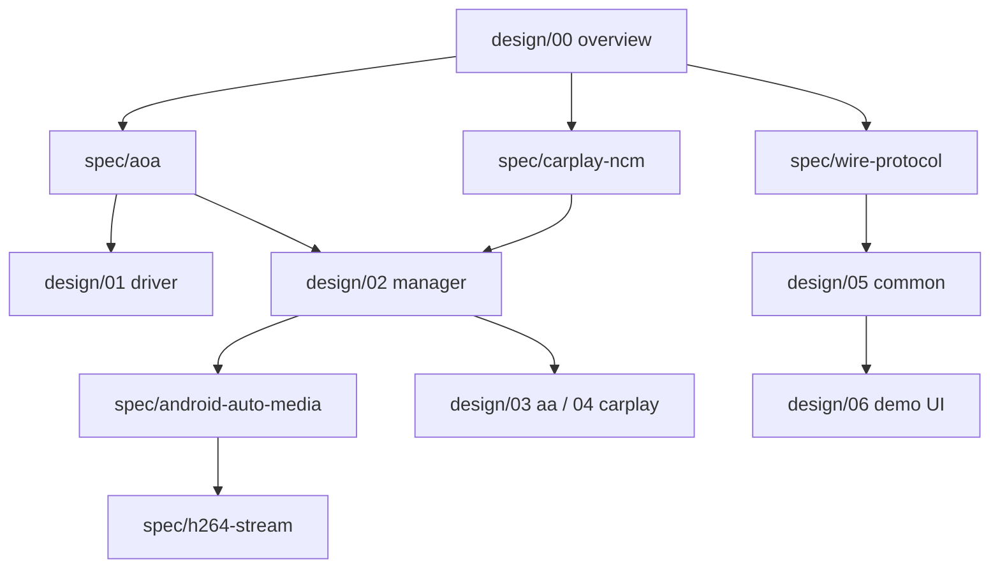

# Tài liệu HUPI module-usb

## Bắt đầu nhanh

| Bạn muốn… | Đọc |
|---|---|
| Hiểu hệ thống + sơ đồ giao tiếp khối | **[design/00-system-overview.md](design/00-system-overview.md)** |
| Chi tiết từng khối (component, sequence) | **[design/README.md](design/README.md)** |
| Spec: AOA cần gì / vì sao | **[spec/aoa.md](spec/aoa.md)** |
| Spec: CarPlay / NCM / MFi | **[spec/carplay-ncm.md](spec/carplay-ncm.md)** |
| Kiến thức nền USB·SDL·libs | [KNOWLEDGE.md](KNOWLEDGE.md) |
| Build & chạy demo | [DEVELOPMENT.md](DEVELOPMENT.md) |
| Checklist media thật | [MEDIA.md](MEDIA.md) |
| Thiếu gì trên board | [NEEDED.md](NEEDED.md) |

## Cấu trúc thư mục docs

```text
docs/
  README.md                 ← bạn đang đọc
  ARCHITECTURE.md           tóm tắt kiến trúc
  KNOWLEDGE.md              kiến thức nền + libs
  DEVELOPMENT.md            build / chạy / test
  MEDIA.md                  H.264 stub → AASDK/MFi
  NEEDED.md                 input còn thiếu
  design/                   detailed design theo khối + diagram
    00-system-overview.md
    01-usb-driver.md
    02-usb-manager.md
    03-libhu-aa.md
    04-libhu-carplay.md
    05-common-wire.md
    06-demo-ui.md
  spec/                     specification: cần gì / vì sao
    aoa.md
    android-auto-media.md
    carplay-ncm.md
    wire-protocol.md
    h264-stream.md
```

## Lộ trình đọc đề xuất


