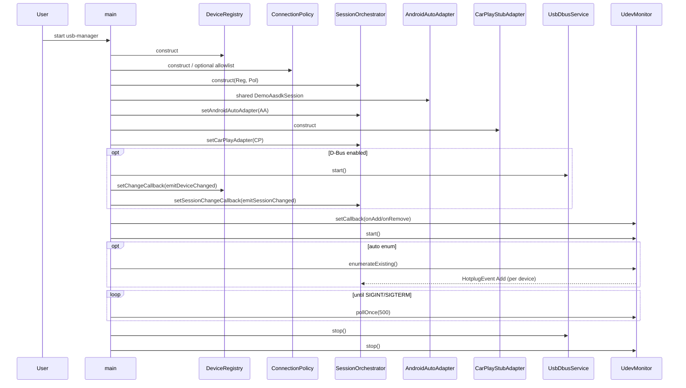
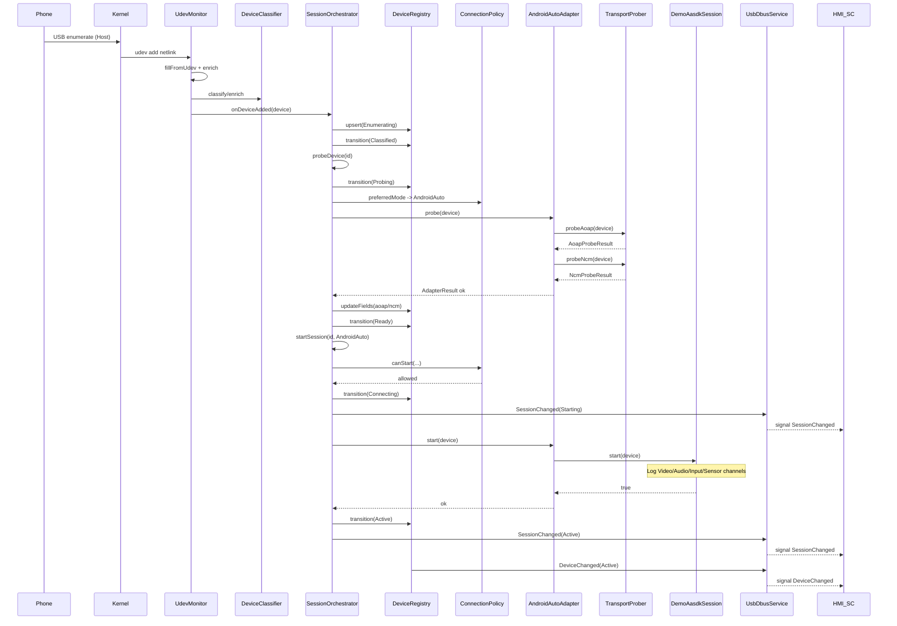
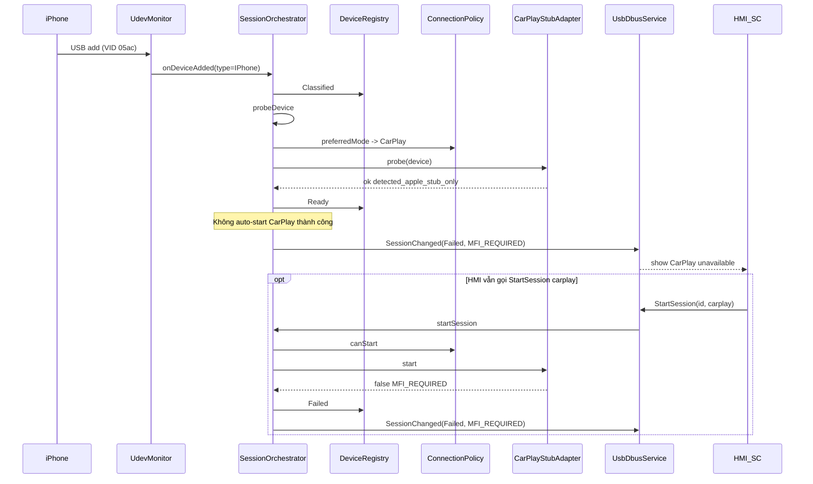
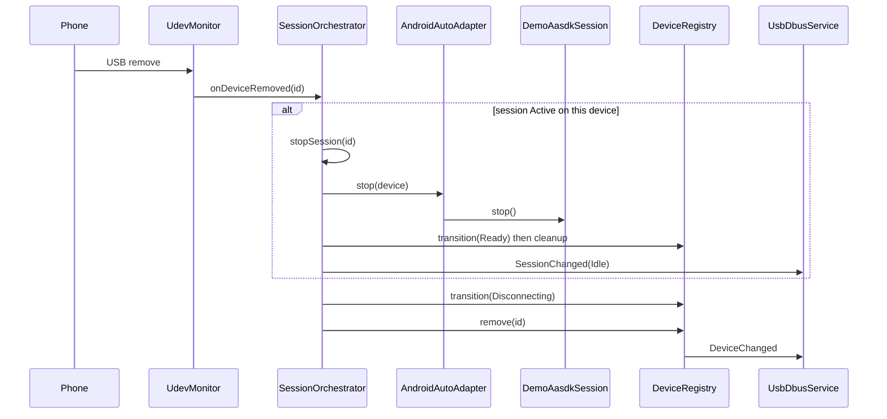
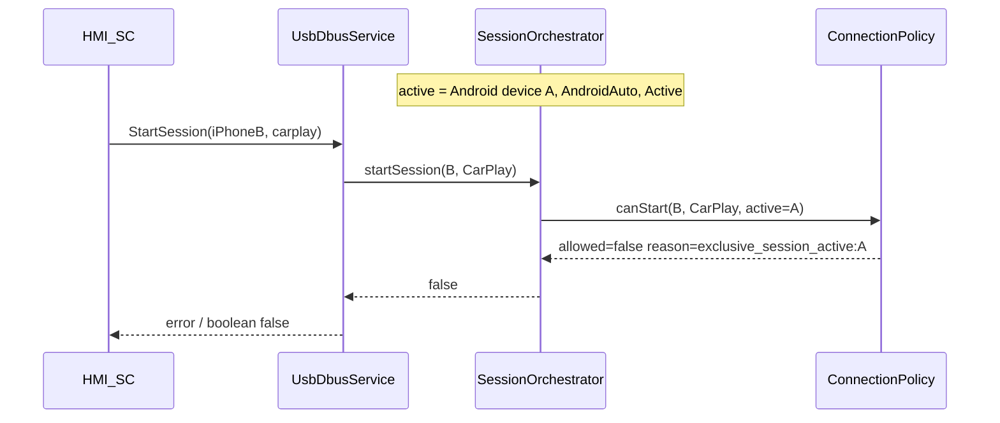
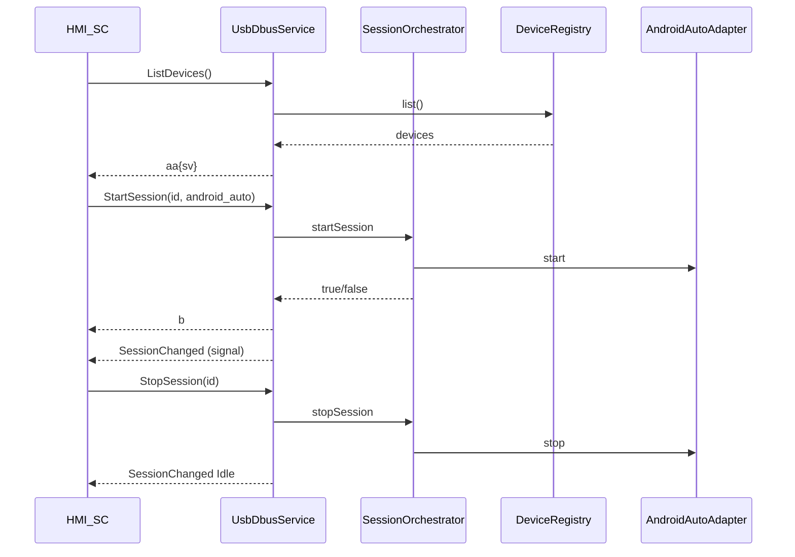
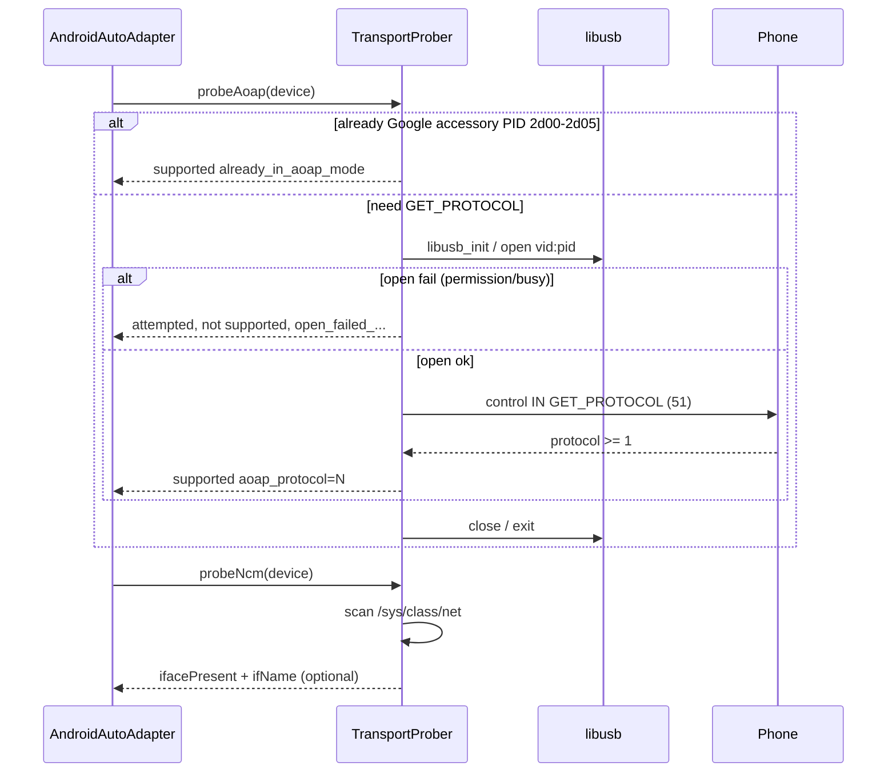
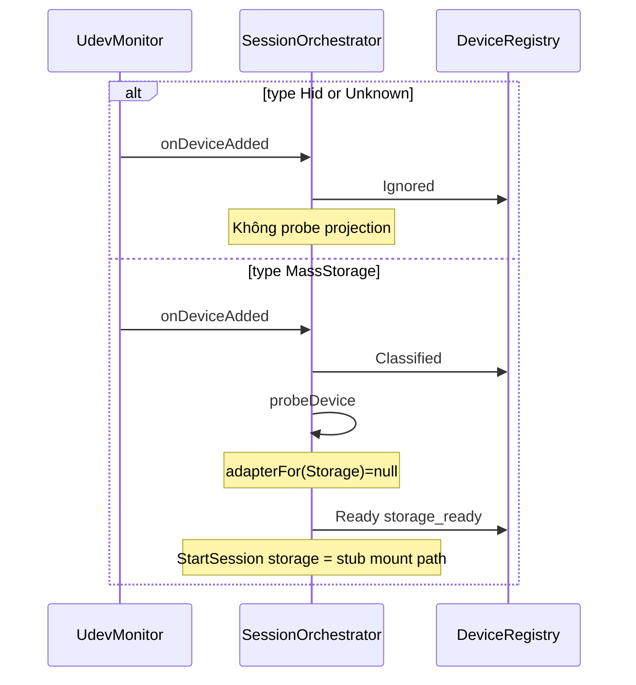
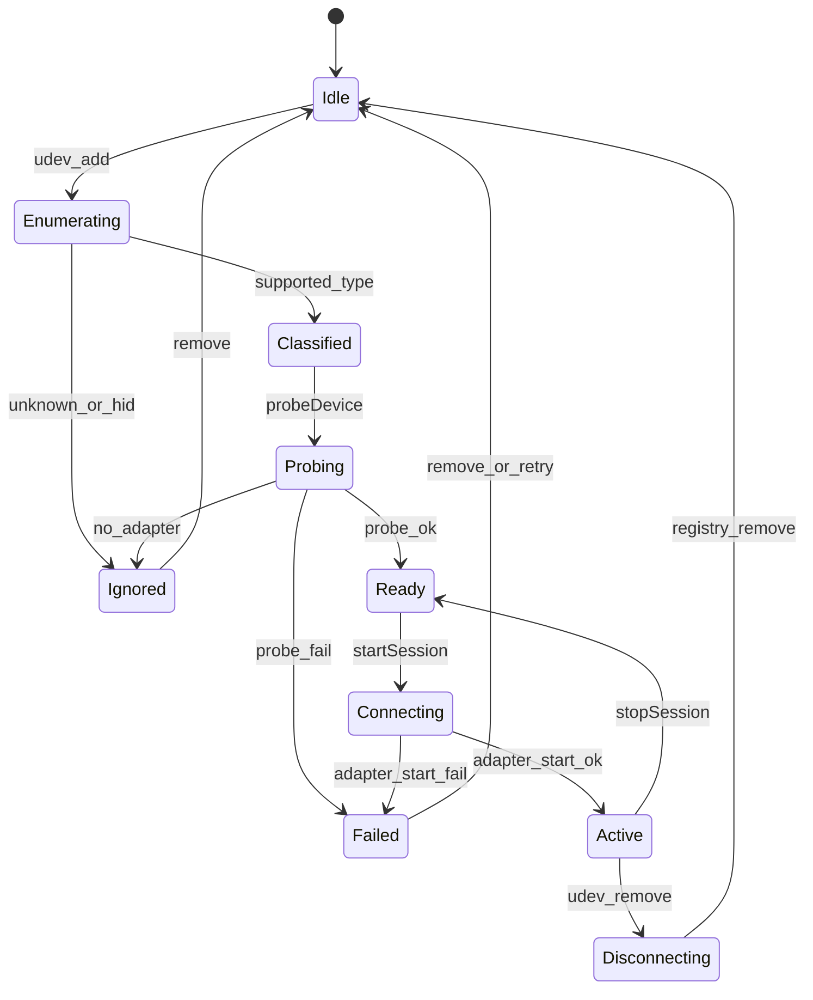

# Sequence diagrams — usb-manager

Các luồng runtime chính của Connectivity SC prototype (USB Host).  
Đối chiếu function: [FUNCTIONS.md](FUNCTIONS.md).

---

## 1. Khởi động daemon

---

## 2. Android phone plug-in → AA demo session (happy path)

Luồng mặc định khi classify ra `Android`: probe xong → **auto** `startSession`.

---

## 3. iPhone plug-in → CarPlay stub (`MFI_REQUIRED`)

---

## 4. Unplug khi đang Active

---

## 5. Exclusive session (AA đang chạy, xin CarPlay)

---

## 6. HMI điều khiển qua D-Bus (manual start/stop)

---

## 7. Chi tiết AOAP probe (P2)

---

## 8. Mass storage / Unknown / HID

---

## 9. State machine thiết bị (nhìn ngang)

---

## Gợi ý đọc diagram

1. Bắt đầu với **§2 Android plug-in** — đây là đường chính của prototype.
2. So sánh với **§3 CarPlay stub** — cùng orchestrator, khác adapter outcome.
3. Đọc `SessionOrchestrator.cpp` theo đúng tên method xuất hiện trên mũi tên.
4. Khi học AASDK thật, diagram §2 đoạn `DemoAasdkSession` sẽ được thay bằng channel AASDK thật (vẫn giữ biên `IAasdkSession`).
