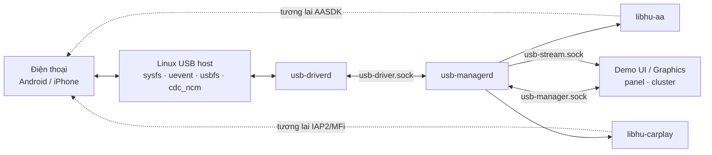
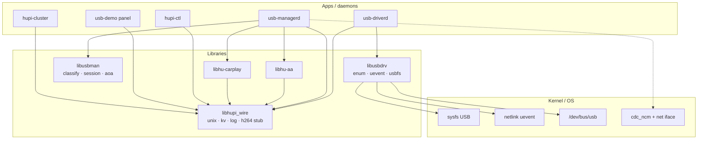
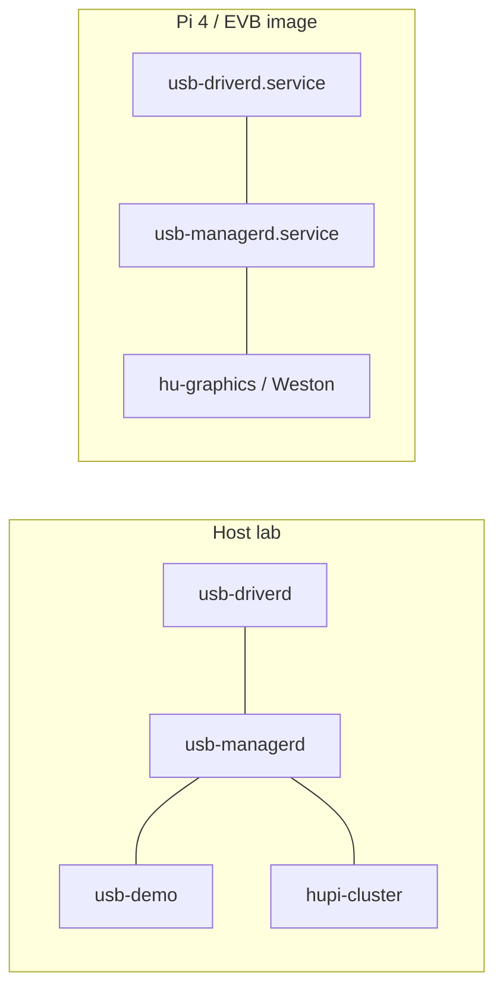
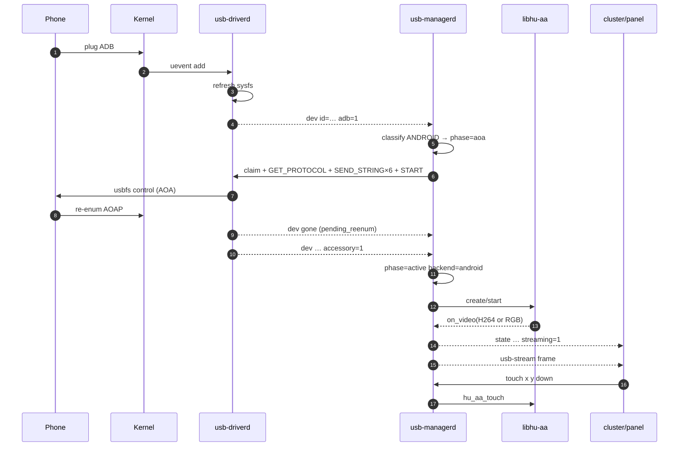
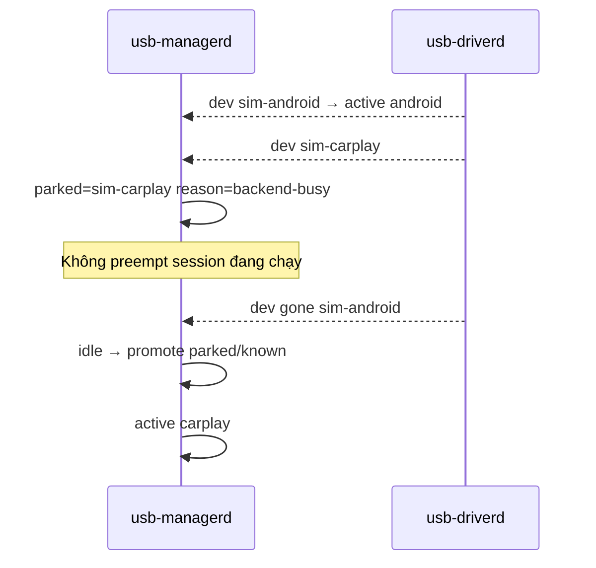

# 0 — System overview & giao tiếp các khối

## 1. Bài toán

Head unit (Pi 4 / EVB) cần:

1. Phát hiện điện thoại USB (Android / iPhone).  
2. Đưa máy vào mode projection đúng (AOA hoặc CDC-NCM).  
3. Chỉ chạy **một** backend media tại một thời điểm.  
4. Đẩy video (+ nhận touch) tới UI / graphics.  
5. Lab chạy được **không cần** điện thoại thật (sim) và **không cần** AASDK/MFi ngay (stub).

## 2. Context diagram



## 3. Component diagram (trong repo)



### Vì sao tách khối như vậy?

| Khối | Trách nhiệm duy nhất | Vì sao không gộp |
|---|---|---|
| `usb-driverd` | Biên giới USB host (enum, claim, ctrl) | Nhiều client có thể quan sát device; chỉ **một** chỗ mở usbfs |
| `usbman` (lib) | Policy thuần — test được không cần USB | Tách logic khỏi I/O / poll loop |
| `usb-managerd` | Orchestration + media + stream | Ghép policy với AOA queue và lib media |
| `libhu-aa` / `libhu-carplay` | Protocol media riêng từng OS | AASDK ≠ MFi; thay độc lập |
| `hupi_wire` | Transport lab chung | Tránh mỗi daemon tự invent socket framing |

## 4. Deployment (lab vs board)



| Môi trường | Runtime dir | Video consumer |
|---|---|---|
| Lab | `$HUPI_RUNTIME` /tmp | SDL cluster |
| Board | `/run/hupi` | graphics daemon (sau này) |

## 5. Sequence — Android Auto (happy path)



## 6. Sequence — CarPlay (happy path)

```mermaid
sequenceDiagram
  autonumber
  participant Phone
  participant Kernel
  participant Driver as usb-driverd
  participant Man as usb-managerd
  participant CP as libhu-carplay
  participant UI

  Phone->>Kernel: plug + CDC-NCM
  Kernel->>Driver: uevent
  Driver-->>Man: dev … apple=1 ncm=1 net=usb0
  Man->>Man: classify CARPLAY → active
  Man->>Kernel: ip link set usb0 up
  Man->>CP: create(iface)/start
  Note over CP: MFi/IAP2 thật sau này;\nhiện H.264 stub
  CP-->>Man: on_video
  Man-->>UI: state + stream frames
```

## 7. Sequence — hai máy cùng lúc (parking)



## 8. Bản đồ file → khối

| Khối | Sources chính |
|---|---|
| usb-driver | `modules/usb-driver-userlayer/` |
| usb-manager | `modules/usb-man/` |
| AA media | `modules/libhu-aa/` |
| CarPlay media | `modules/libhu-carplay/` |
| Common | `modules/common/` |
| Demo UI | `rasp4/build-demo/apps/` |

Tiếp theo: chi tiết từng khối trong các file `01`…`06`.
