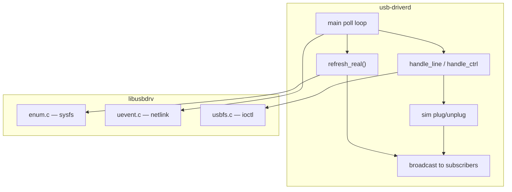
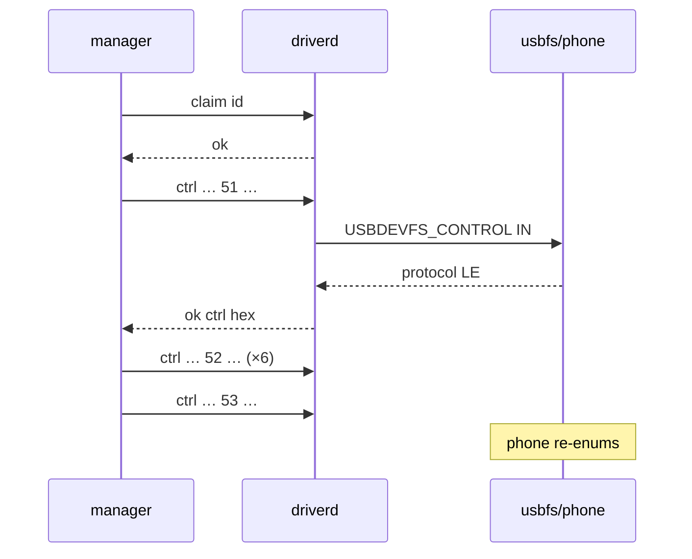

# 1 — Design: khối usb-driver (userlayer)

## 1. Vai trò

**Biên giới duy nhất** giữa userspace HUPI và Linux USB host stack.

| Làm | Không làm |
|---|---|
| Enum sysfs, nghe uevent | Thay thế `usbcore` |
| Publish `dev` / `dev gone` | Quyết định AA vs CarPlay |
| Exclusive `claim` + usbfs `ctrl` | Chạy AASDK / IAP2 |
| Thiết bị `sim` cho lab | Decode video |

## 2. Component nội bộ



### Struct / “class” chính

```text
usbdrv_device_t     — snapshot 1 device từ sysfs
usbdrv_uevent_t     — 1 sự kiện netlink đã parse
usbdrv_control_t    — setup packet control transfer
ud_dev (driverd)    — device nội bộ daemon + claim_fd + cờ sim
hupi_peer_t         — client socket đã connect
```

| Field `ud_dev` quan trọng | Ý nghĩa thiết kế |
|---|---|
| `id` = `busnum-devnum` | Ổn định hơn sys name khi interface đổi |
| `claim_fd` | Exclusive lease theo fd peer |
| `ncm/adb/accessory/…` | Precomputed cho manager classify nhanh |
| `sim` | Nhánh ctrl giả lập AOA không cần kernel |

## 3. Giao tiếp bên ngoài

```mermaid
flowchart LR
  NL[netlink uevent] --> D[usb-driverd]
  SYS[/sys/bus/usb] --> D
  USBFS[/dev/bus/usb] --> D
  D <-->|usb-driver.sock| M[usb-managerd]
  D <-->|usb-driver.sock| C[hupi-ctl]
```

### API text (server)

| Lệnh | Hành vi |
|---|---|
| `sub` | Đăng ký broadcast + dump toàn bộ device hiện có |
| `list` | Dump một lần, không sub |
| `claim <id>` / `release <id>` | Exclusive |
| `ctrl <id> bm req wValue wIndex wLen [hex]` | Control transfer (cần claim) |
| `sim plug android\|carplay` | Thêm device giả |
| `sim unplug [id]` | Rút sim |

Sự kiện đẩy: `dev id=…` hoặc `dev gone id=…`.

## 4. Logic `refresh_real` (diff)

```mermaid
flowchart TD
  A[enum sysfs → next[]] --> B{id cũ không còn trong next?}
  B -->|có| C[emit gone]
  B -->|không| D{id mới hoặc payload đổi?}
  D -->|có| E[emit dev + kế thừa claim_fd]
  D -->|không| F[im lặng]
  C --> G[g_real = next]
  E --> G
  F --> G
```

**Vì sao diff?** Tránh spam `dev` mỗi uevent khi không đổi classify-relevant fields.

## 5. Control path (AOA)



Nhánh **sim**: req 51→`0200`, 52→ok, 53→đổi pid AOAP + `gone`+`dev` cùng id.

## 6. Quyết định thiết kế quan trọng

| Quyết định | Lý do |
|---|---|
| Một daemon sở hữu usbfs | Tránh race multi-open `/dev/bus/usb` |
| Claim theo peer fd | Khi client chết → `drop_claims` tự nhả |
| Sim trong driver, không trong manager | Manager chỉ thấy `dev` giống thiết bị thật |
| Không classify AA/CarPlay ở đây | Policy thuộc session layer |

## 7. File map

| File | Trách nhiệm |
|---|---|
| `driverd.c` | Daemon, protocol, sim, poll |
| `enum.c` | sysfs → `usbdrv_device_t` |
| `uevent.c` | netlink parse/recv |
| `usbfs.c` | open + control ioctl |
| `include/usbdrv.h` | API lib |

Spec liên quan: [../spec/aoa.md](../spec/aoa.md), [../spec/wire-protocol.md](../spec/wire-protocol.md).
