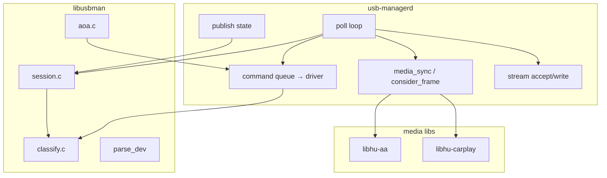
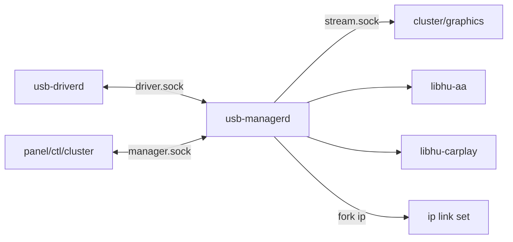
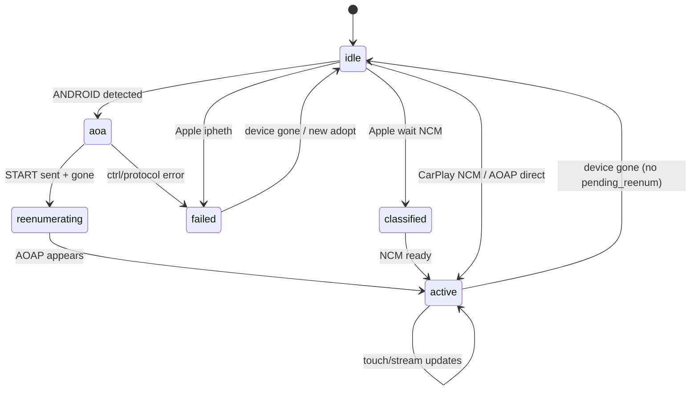
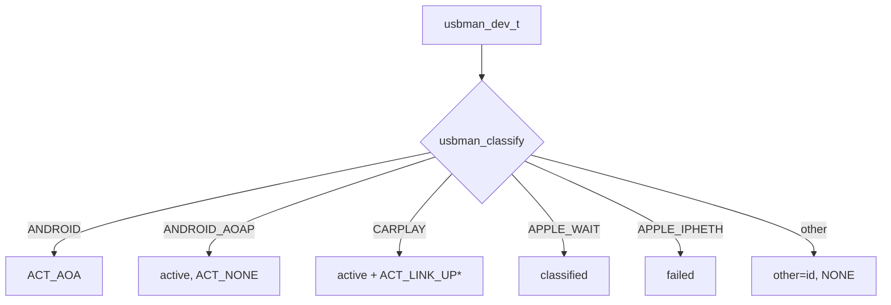
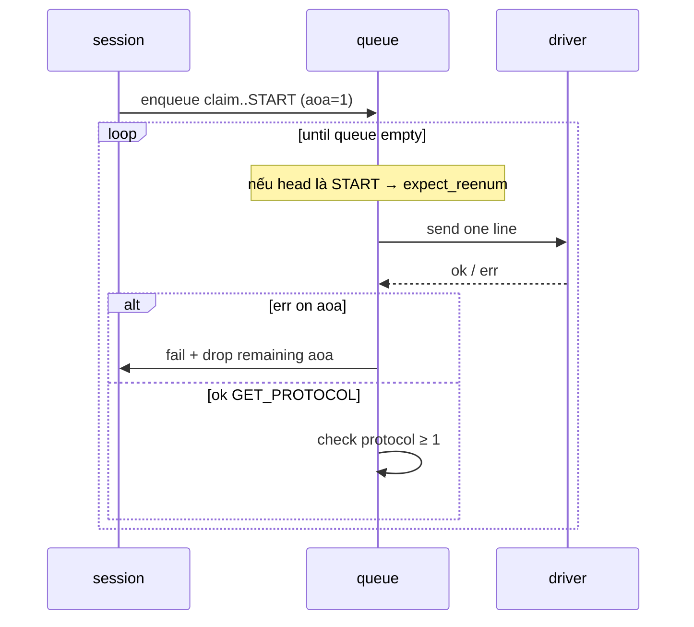
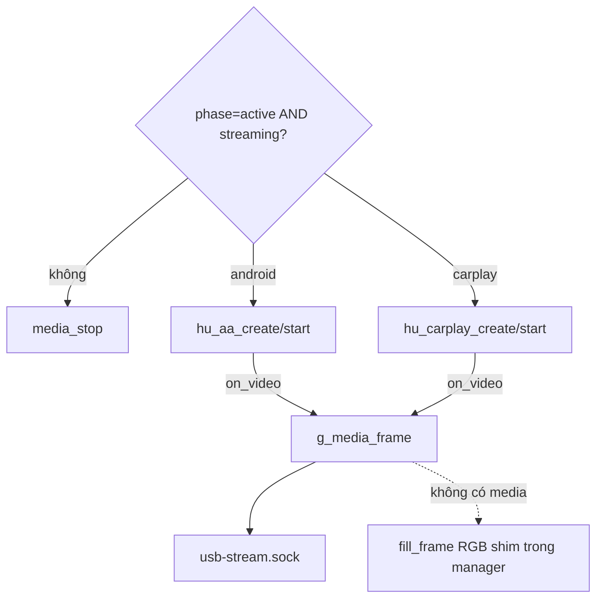

# 2 — Design: khối usb-manager

## 1. Vai trò

**Orchestrator** projection: nhận device events → policy session → AOA / link-up → bật media → stream video + nhận touch/UI.

| Làm | Không làm |
|---|---|
| Classify + state machine | Mở usbfs trực tiếp |
| Queue lệnh tuần tự xuống driver | Implement AASDK/MFi |
| `media_sync` AA/CarPlay | Decode H.264 |
| Publish `state` + binary stream | Enum sysfs |

Tách **lib `usbman`** (pure) khỏi **daemon `managerd`** (I/O) để unit-test policy không cần USB.

## 2. Component nội bộ



### “Class” / struct

```text
usbman_dev_t       — device đã parse từ dòng "dev …"
usbman_session_t   — backend/phase/streaming/parked/…
usbman_kind_t      — kết quả classify
usbman_action_t    — NONE | AOA | LINK_UP
qitem              — 1 lệnh chờ gửi driver (+ cờ aoa)
```

## 3. Giao tiếp



### API manager.sock

| Lệnh | Ý nghĩa |
|---|---|
| `sub` / `status` | Nhận / hỏi `state …` |
| `stream on\|off` | User override streaming |
| `touch x y down` | 0…10000 → session + media |
| `sim …` | Proxy nguyên dòng xuống driver queue |

## 4. State machine session



| Phase | Ý nghĩa UX / media |
|---|---|
| `idle` | Không projection |
| `aoa` | Đang chạy chuỗi AOA |
| `reenumerating` | Chờ phone plug lại AOAP |
| `classified` | Apple thấy, chờ NCM |
| `active` | Có thể stream |
| `failed` | Lỗi / policy từ chối |

## 5. Classify → action



\* sim CarPlay: không `ip link` (không có iface thật).

## 6. Queue AOA / pump



**Vì sao tuần tự?** Mỗi bước AOA phụ thuộc bước trước; parallel ctrl làm hỏng START/re-enum.

## 7. Media & stream



Một consumer stream tại một thời điểm (client mới thay client cũ).

## 8. File map

| File | Trách nhiệm |
|---|---|
| `managerd.c` | Daemon: poll, queue, media, stream |
| `session.c` | State machine |
| `classify.c` | kind + parse_dev |
| `aoa.c` | Build chuỗi lệnh AOA |
| `ctl.c` | CLI `hupi-ctl` |

Spec: [../spec/aoa.md](../spec/aoa.md), [../spec/carplay-ncm.md](../spec/carplay-ncm.md), [../spec/wire-protocol.md](../spec/wire-protocol.md).
