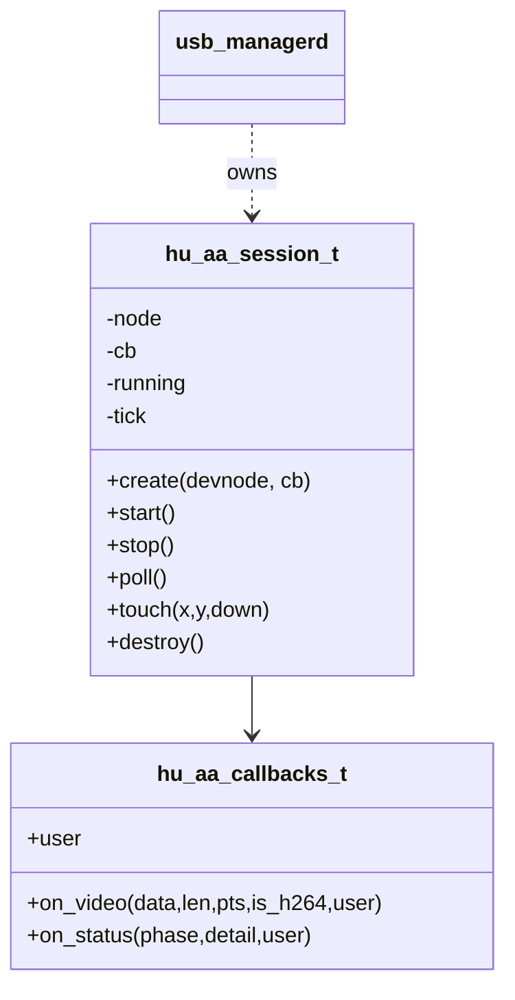
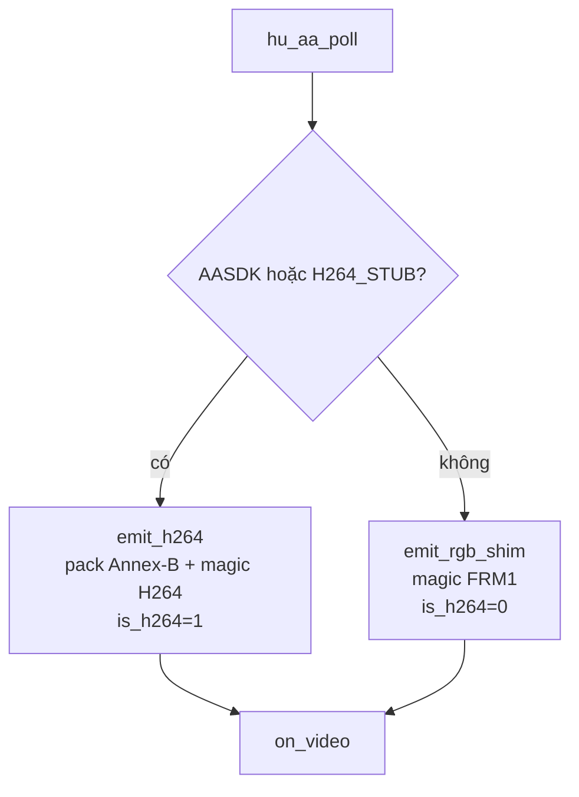
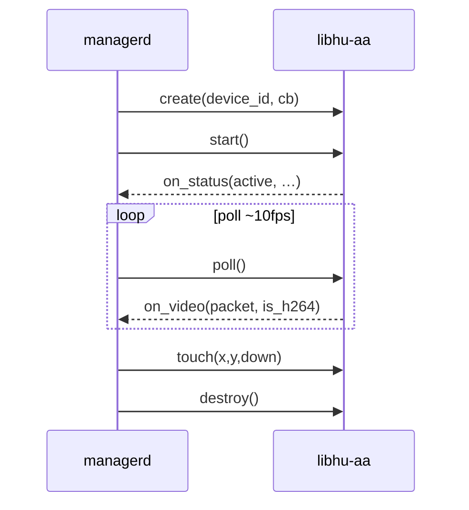

# 3 — Design: libhu-aa (Android Auto media)

## 1. Vai trò

Sở hữu **session media Android Auto** sau khi USB đã ở AOAP / session `active`.

| Làm | Không làm |
|---|---|
| start/stop/poll/touch | AOA control transfer |
| Emit video qua callback | Claim usbfs |
| Hook AASDK khi bật cờ | Session policy (park/idle) |

`usb-managerd` gọi create/start khi `backend=android` + streaming; destroy khi idle/fail.

## 2. Component / API

## 3. Hai đường video

| Build | `detail` status | Nguồn AU |
|---|---|---|
| stub ON, no AASDK | `h264-stub` | `hupi_h264_stub_au()` |
| AASDK ON | `aasdk` | TODO messenger → cùng packer |
| stub OFF | `shim` | RGB sọc xanh |

**Điểm thay code AASDK:** `emit_h264()` trong `hu_aa.c` — giữ `hupi_h264_pack_frame()`.

## 4. Sequence với manager

## 5. Dependency

| Hiện có | Cần thêm (thật) |
|---|---|
| `hupi_wire`, `hupi_h264` | `third_party/aasdk` |
| CMake `HUPI_MEDIA_H264_STUB` | Boost/protobuf theo AASDK |
| | Input channel inject trong `hu_aa_touch` |

Spec: [../spec/android-auto-media.md](../spec/android-auto-media.md), [../spec/h264-stream.md](../spec/h264-stream.md).
