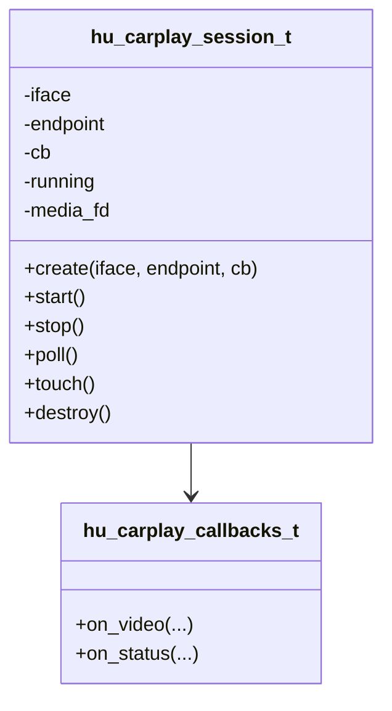
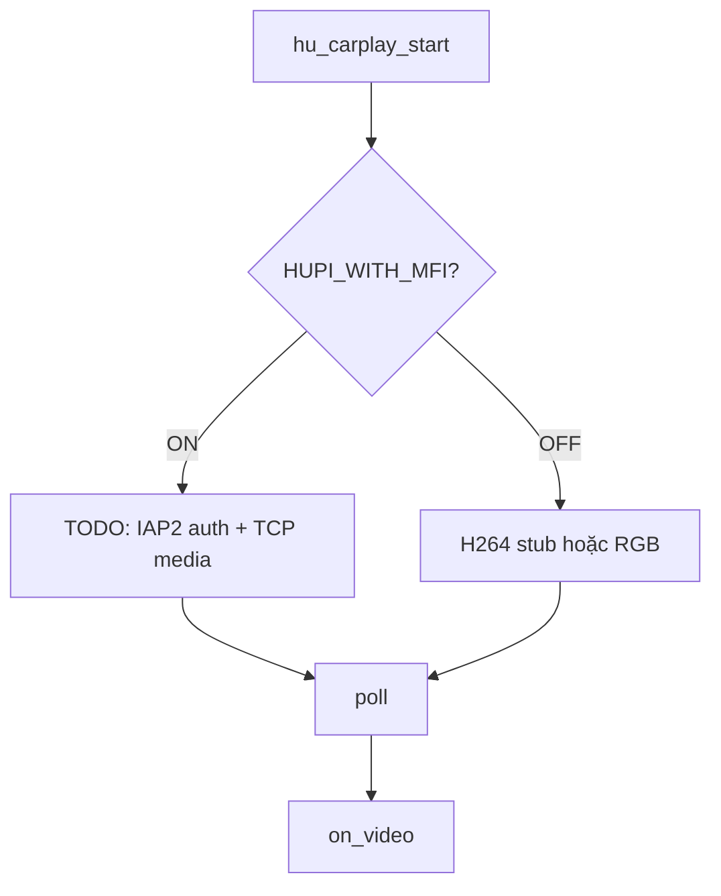
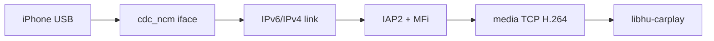

# 4 — Design: libhu-carplay (CarPlay media)

## 1. Vai trò

Session media CarPlay **sau** khi có CDC-NCM (+ link up). Không làm AOA; không classify.

| Làm | Không làm |
|---|---|
| create(iface, endpoint) / start / poll / touch | `ip link` (manager làm) |
| Hook IAP2/MFi khi có | Enum USB |
| Emit video callback | Auth cert (SDK bên ngoài) |

## 2. Component / API

Default endpoint lab: `10.10.10.1:5000` trên iface `usb0` (hoặc tên từ session.net).

## 3. Đường media

| Cờ | Status detail | Video |
|---|---|---|
| MFI ON | `mfi` | TODO TCP AU |
| stub ON | `h264-stub` | Annex-B hardcode |
| cả hai OFF | `ncm-shim` | RGB xanh dương |

## 4. Quan hệ với NCM / MFi

**Vì sao không ipheth?** Policy HUPI / CarPlay wired hiện đại yêu cầu NCM; ipheth là tether cũ, không đủ đường CarPlay chuẩn trong thiết kế này.

## 5. File & dependency

| File | Vai trò |
|---|---|
| `hu_carplay.c` | Session + stub/poll |
| `hu_carplay.h` | API |

Cần thêm: `libiap2`, `libhu-mfi`, cert MFi — xem [../NEEDED.md](../NEEDED.md).  
Spec: [../spec/carplay-ncm.md](../spec/carplay-ncm.md).
