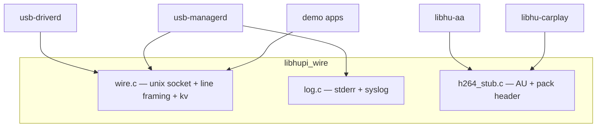

# 5 — Design: common (wire, log, H.264 packer)

## 1. Vai trò

Transport + tiện ích dùng chung mọi process lab — **không** chứa chính sách USB/media.

## 2. Component



## 3. Text framing


| API | Mục đích |
|---|---|
| `hupi_listen_unix` / `connect_unix` | Socket file dưới runtime dir |
| `hupi_send_line` | Thêm `\n`, gửi đủ |
| `hupi_peer_recv` / `pull` | Non-blocking framing |
| `hupi_escape` / `unescape` | An toàn field có space |
| `hupi_log_*` | TRACE…ERROR + tag process |

## 4. Binary frame packer

```text
hupi_h264_pack_frame(out, cap, w, h, keyframe, au, au_len)
→ [magic H264 | w | h | flags | nbytes | AU…]
```

Stub AU: SPS+PPS+IDR placeholder + marker `HUPI-H264-STUB`.

## 5. Vì sao dùng unix-line thay D-Bus (lab)?

| unix-line | D-Bus (tương lai sơ đồ HUPI) |
|---|---|
| Ít dependency, dễ `hupi-ctl`/printf debug | Chuẩn desktop/automotive bus |
| Đủ cho 2 daemon + demo | FD passing / introspection |
| Đổi sau được (`libhu-bus`) | Cần thêm daemon/policy |

Spec: [../spec/wire-protocol.md](../spec/wire-protocol.md), [../spec/h264-stream.md](../spec/h264-stream.md).
