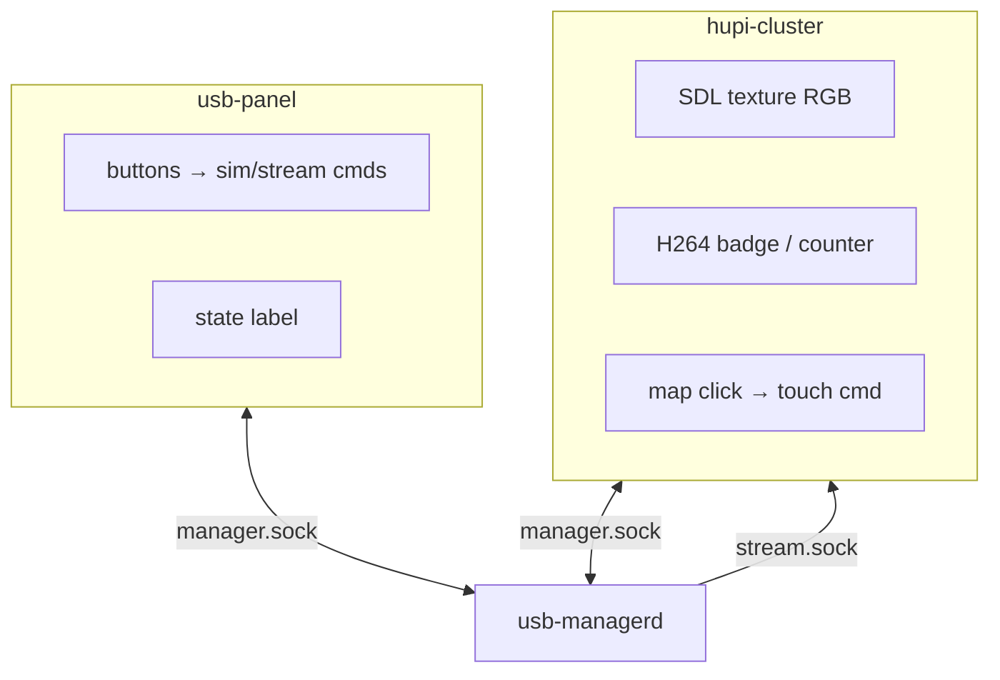
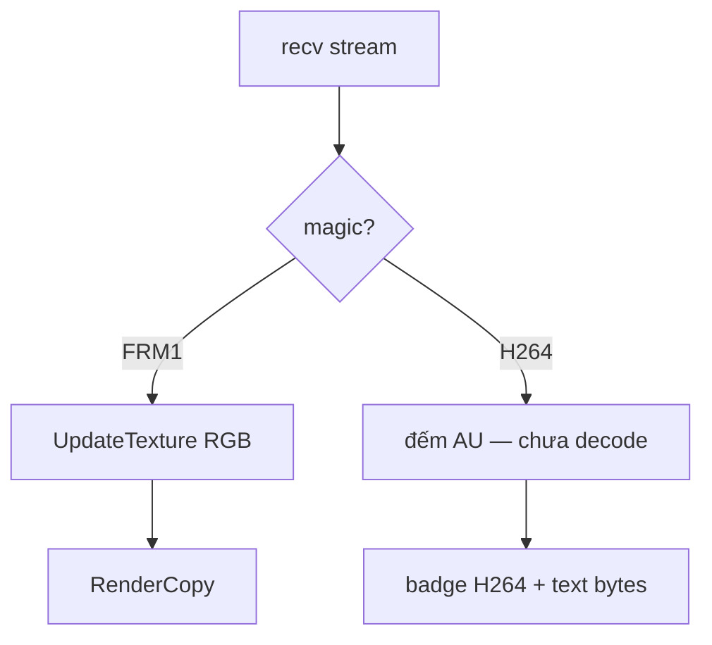

# 6 — Design: demo UI (SDL)

## 1. Vai trò

Lab visualization — **không** thay `hu-graphics` production.

| App | Việc |
|---|---|
| `usb-demo` (panel) | Nút sim plug/unplug, stream on/off; hiện `state` |
| `hupi-cluster` | Giả lập cụm đồng hồ + vùng projection + touch |

## 2. Component

## 3. Video path trong cluster

Touch: pixel trong vùng proj → chuẩn hóa 0…10000 → `touch x y down`.

## 4. Dependency

- SDL2 (`HUPI_HOST_SDL=ON`)
- `hupi_wire` (link + kv)
- Font helper trong `apps/common/ui.c` (+ stb nếu dùng)

## 5. Vì sao SDL trên host?

| Lý do | |
|---|---|
| Nhanh iterate session/AOA/sim | Không cần flash board |
| Thấy state + stream ngay | Debug policy |
| Không phụ thuộc Weston/EVB panel | Tách concern graphics thật |
