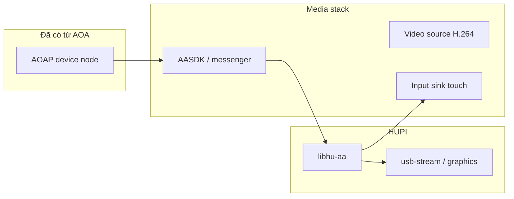

# Spec: Android Auto media (sau AOAP)

## 1. Vấn đề

AOA chỉ **đổi mode USB**. Video/map/touch của Android Auto cần **session protocol** riêng (thường qua AASDK): mở kênh, nhận H.264, gửi input.

## 2. Cần những gì?

| Thành phần | Vì sao cần |
|---|---|
| **AOAP ổn định** | Không có accessory mode → không có endpoint AA |
| **AASDK (hoặc tương đương)** | Parse AA protocol, session video/audio/input |
| **libhu-aa boundary** | Tách daemon khỏi C++/SDK; dễ stub |
| **H.264 path** | AA projection là video nén, không phải RGB desktop |
| **Touch normalize** | UI gửi 0…10000; SDK cần mapping riêng |
| **Callback on_video** | Manager không phụ thuộc kiểu SDK bên trong |

## 3. Tầng stub hiện tại — cần / không cần

| Có ngay (stub) | Chưa cần để lab session |
|---|---|
| `hupi_h264_stub_au` + pack magic H264 | AASDK tree |
| `HUPI_MEDIA_H264_STUB=ON` | Phone thật |
| Log `detail=h264-stub` | Decode đẹp trên SDL |

**Vì sao stub trước?** Nối pipeline manager→stream→UI/graphics và hợp đồng API trước khi kéo dependency nặng (Boost/protobuf/AASDK).

## 4. Khi gắn AASDK thật — checklist

1. `third_party/aasdk` + `-DHUPI_WITH_AASDK=ON`  
2. Trong `emit_h264()`: pull AU từ messenger thay `hupi_h264_stub_au`  
3. Giữ `hupi_h264_pack_frame` (không đổi consumer)  
4. `hu_aa_touch` → input channel SDK  
5. Verify `detail=aasdk`, `aasdk=1` trong log  

Xem [../MEDIA.md](../MEDIA.md).

## 5. Thiếu từng thứ thì sao?

| Thiếu | Hậu quả |
|---|---|
| AOA chưa xong | Không bao giờ vào `libhu-aa` start |
| AASDK thiếu, stub OFF | Chỉ RGB shim — không tập đường H264 |
| AASDK thiếu, stub ON | Pipeline H264 lab OK, không phải video phone |
| Không có graphics decode | Cluster chỉ đếm AU (đúng thiết kế tạm) |

## 6. Ranh giới với usb-manager

| Manager | libhu-aa |
|---|---|
| Khi nào start/stop | Cách nói chuyện AA |
| stream on/off | Định dạng AU nội bộ SDK |
| Forward touch | Map sang AA input |
