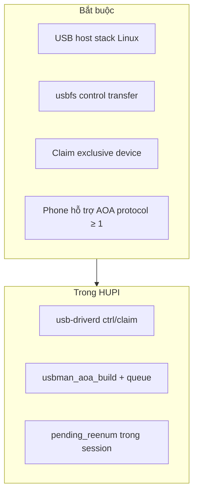

# Spec: Android Open Accessory (AOA)

## 1. Vấn đề cần giải quyết

Phone Android cắm vào thường ở mode **ADB / MTP / charging**. Head unit **không** nói chuyện Android Auto media được ở mode đó.  
Cần một cơ chế **chuẩn Google** để phone tự chuyển sang **accessory mode (AOAP)** — lúc đó host mới là “phụ kiện” và mở được kênh AA.

## 2. Cần những gì?

| Thành phần | Vì sao cần |
|---|---|
| **USB host + usbfs** | AOA là vendor-specific **control** trên EP0, không phải netlink |
| **GET_PROTOCOL (51)** | Biết phone có AOA không; protocol `< 1` → abort |
| **SEND_STRING × 6 (52)** | Phone hiện dialog / chọn accessory; thiếu chuỗi → START có thể fail |
| **START (53)** | Kích hoạt re-enumeration sang AOAP |
| **Claim exclusive** | Tránh ADB daemon / process khác xen control giữa chừng |
| **Xử lý re-enum** | START khiến `dev gone` tạm — nếu về idle sẽ mất session |
| **Identity strings** | Manufacturer/model/… — AA app nhận diện head unit |

## 3. Không cần gì cho bước AOA?

| Không cần cho AOA thuần | Vì sao |
|---|---|
| AASDK | AASDK chạy **sau** khi đã AOAP |
| CDC-NCM | Đó là đường Apple |
| SDL / graphics | AOA chỉ là USB control |
| MFi / IAP2 | Apple only |

## 4. Sequence chuẩn (đối chiếu code)

| Bước | bm | bRequest | Data | Code |
|---|---|---|---|---|
| claim | — | — | — | `claim <id>` |
| GET_PROTOCOL | 0xC0 | 51 | IN 2 B LE | `ctrl … 192 51 0 0 2` |
| SEND_STRING | 0x40 | 52 | OUT string, wIndex=i | `ctrl … 64 52 0 i len hex` |
| START | 0x40 | 53 | không payload | `ctrl … 64 53 0 0 0` |

Implement: `modules/usb-man/src/aoa.c` + thực thi tại `driverd.c` `handle_ctrl`.

## 5. Điều kiện tiên quyết trên phone

- USB debugging / cho phép accessory (tuỳ OS version).  
- Hỗ trợ AOA v1+.  
- User có thể phải xác nhận dialog “Allow accessory”.  
- Một số máy OEM hạn chế AOA → GET_PROTOCOL fail → session `failed` / `aoa-protocol`.

## 6. Hậu điều kiện (sau START thành công)

| Quan sát | Ý nghĩa |
|---|---|
| `dev gone` rồi `dev` mới cùng logic session | Re-enum |
| `vid=0x18d1` + pid `0x2d00` hoặc `0x2d01` | AOAP |
| `accessory=1` | classify → `ANDROID_AOAP` → `phase=active` |

## 7. Failure modes & xử lý HUPI

| Lỗi | Reason / hành vi |
|---|---|
| `err need-claim` / busy | Claim trước; một peer |
| `err usbfs` | Quyền / device biến mất |
| protocol &lt; 1 | `aoa-protocol`, drop queue AOA |
| ctrl err giữa chuỗi | `aoa-ctrl`, drop phần AOA còn lại |
| START ok nhưng không bao giờ AOAP | Treo `reenumerating` — cần timeout (cải tiến tương lai) |

## 8. Sim lab — cần gì thay phone?

| Thay thế | Cách HUPI giả |
|---|---|
| Phone ADB | `sim plug android` (adb=1) |
| GET_PROTOCOL | Trả `02 00` |
| START re-enum | `gone` + `dev` accessory trên **cùng id** |

Không cần kernel USB thật cho đường sim.

## 9. Liên kết design

- [../design/01-usb-driver.md](../design/01-usb-driver.md) — thực thi ctrl  
- [../design/02-usb-manager.md](../design/02-usb-manager.md) — queue + session  
- Tiếp theo sau AOAP: [android-auto-media.md](android-auto-media.md)
