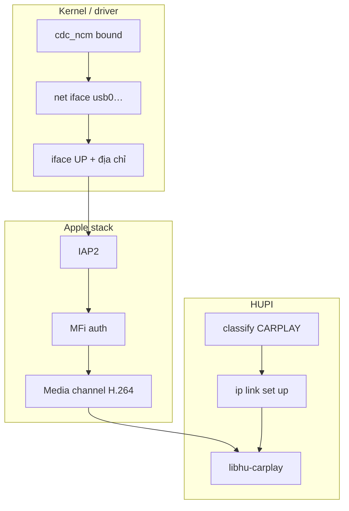

# Spec: CarPlay wired (CDC-NCM + IAP2/MFi)

## 1. Vấn đề

iPhone không dùng AOA. CarPlay có dây đi qua **USB networking** (CDC-NCM) rồi **IAP2** trên IP, có **MFi** authentication — khác hoàn toàn Android.

## 2. Cần những gì?

| Thành phần | Vì sao cần |
|---|---|
| **VID Apple `0x05ac`** | Nhận diện iPhone/iPad |
| **CDC-NCM interface** | Transport mạng cho CarPlay wired hiện đại |
| **Driver `cdc_ncm`** | Tạo `usb0` (hoặc tên khác) trong kernel |
| **`ip link set <iface> up`** | Iface DOWN → không có IP/IAP2 |
| **IAP2** | Session phụ kiện Apple trên link |
| **MFi** | Auth bắt buộc với iPhone thật (chip/cert) |
| **libhu-carplay** | Boundary media giống libhu-aa (callback thống nhất) |
| **Cấm ipheth-only** | Tether cũ ≠ đường CarPlay thiết kế HUPI |

## 3. Vì sao *không* dùng ipheth?

| ipheth | CDC-NCM (HUPI) |
|---|---|
| Driver tether cũ | Class networking chuẩn cho CarPlay |
| Không mang đủ stack IAP2/media như thiết kế | Có iface net rõ ràng |
| Policy: `APPLE_IPHETH` → `failed` | `CARPLAY` → link up → media |

Nếu thấy Apple nhưng **chưa** NCM → `APPLE_WAIT` / `waiting-ncm` (chờ kernel), không fail ngay.

## 4. Các giai đoạn & thứ cần ở mỗi giai

| Phase | Cần có | Chưa cần |
|---|---|---|
| Plug Apple, chưa NCM | Enum + classify wait | MFi |
| NCM xuất hiện | `net=` + LINK_UP | Media TCP |
| Media lab stub | libhu-carplay + H264 stub | Cert |
| Media iPhone thật | libiap2 + libhu-mfi + cert + endpoint đúng | SDL |

## 5. Endpoint & mạng

- Default lab: `10.10.10.1:5000` (có thể đổi — [../NEEDED.md](../NEEDED.md)).  
- Cần routing/addressing phù hợp trên iface NCM (board image / network config).  
- **Sanitize tên iface** trước `exec ip` — chống injection (`iface_ok` trong managerd).

## 6. Sim lab

`sim plug carplay` → `apple=1 ncm=1 net=usb0` **không** gọi `ip link` (iface giả).  
Đủ để test session + stream stub.

## 7. Thiếu từng thứ thì sao?

| Thiếu | Hậu quả |
|---|---|
| Không NCM | `classified` / wait mãi |
| NCM nhưng iface down | IAP2/media không lên |
| Không MFi (phone thật) | Auth fail — chỉ stub lab chạy |
| Không decode H264 | UI chỉ thấy badge / counter |

## 8. Liên kết

- Design: [../design/04-libhu-carplay.md](../design/04-libhu-carplay.md), [../design/02-usb-manager.md](../design/02-usb-manager.md)  
- Knowledge: [../KNOWLEDGE.md](../KNOWLEDGE.md) § CarPlay  
