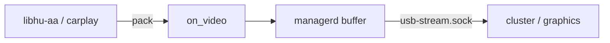

# Spec: Video stream (FRM1 RGB & H264)

## 1. Vấn đề

Cần một **hợp đồng binary** giữa `usb-managerd` và consumer (cluster / graphics) để:

- Lab hiện RGB shim hoặc H.264 stub ngay.  
- Sau này thay payload bằng AU AASDK/CarPlay **không đổi** header layout.

## 2. Cần những gì?

| Thành phần | Vì sao cần |
|---|---|
| **Magic số** | Phân biệt RGB vs H.264 trên cùng socket |
| **Header cố định 20 B** | Framing đơn giản, đọc dần bằng `recv` |
| **w/h** | Consumer biết kích thước |
| **nbytes** | Biết khi nào đủ một frame |
| **is_h264 trên callback** | Manager log / quyết định sau này |
| **Stub AU** | Nối pipeline trước khi có SDK |
| **Giới hạn AU** (`HUPI_H264_AU_MAX`) | Tránh buffer explosion |

## 3. Layout

```text
Offset  Size  FRM1 (RGB)              H264
0       4     magic 0x314D5246        magic 0x34363248
4       4     width                   width
8       4     height                  height
12      4     stride (= w*3)          flags (bit0=keyframe)
16      4     nbytes                  nbytes (AU length)
20      …     RGB24 pixels            Annex-B NAL units
```

Default geometry lab: **640×360** (`HUPI_FRAME_W/H`).

## 4. Ai đóng gói / ai tiêu thụ?



| Producer | Consumer hiện tại | Consumer tương lai |
|---|---|---|
| stub / shim | hupi-cluster | hu-graphics GStreamer |
| AASDK AU | (cùng socket) | decoder H.264 cứng/mềm |

## 5. Vì sao không chỉ gửi raw Annex-B?

- Cùng socket có thể còn RGB shim.  
- Header mang w/h/keyframe giúp decoder/UI.  
- Dễ ghi log `bytes=` và đếm frame.

## 6. Stub vs thật

| Stub | Thật |
|---|---|
| `k_h264_stub_au[]` cố định | AU từng frame từ phone |
| Có thể không decode đẹp | Decode được map/UI AA/CP |
| Marker `HUPI-H264-STUB` | Không cần marker |

Thay stub: [../MEDIA.md](../MEDIA.md) § việc cần làm.

## 7. Thiếu decode thì sao?

- Cluster: badge `H264`, đếm AU — **đủ** chứng minh pipeline.  
- Production: bắt buộc thêm decoder; spec này **không** quy định codec config ngoài Annex-B.

## 8. Liên kết

- `modules/common/include/hupi_h264.h`  
- Design media: [../design/03-libhu-aa.md](../design/03-libhu-aa.md)  
