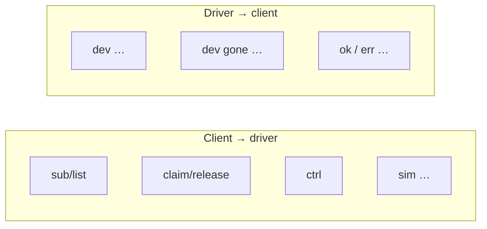
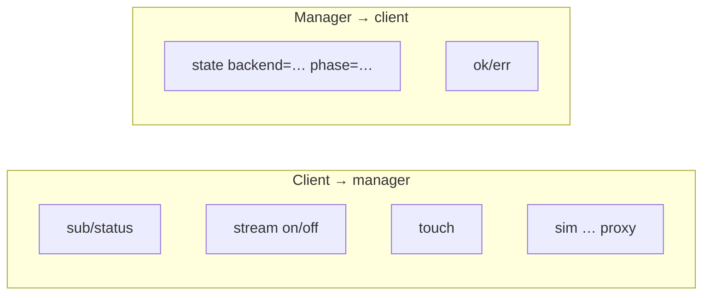

# Spec: Wire protocol (Unix sockets + line text)

## 1. Vấn đề

Hai daemon + nhiều client (manager, panel, ctl, cluster) cần giao tiếp **ổn định, dễ debug**, không kéo D-Bus ngay trên lab.

## 2. Cần những gì?

| Thành phần | Vì sao cần |
|---|---|
| **Unix domain stream** | Local, nhanh, file path dưới runtime dir |
| **Một message = một dòng `\n`** | Dễ `printf` / `hupi-ctl` / log |
| **`key=value` + escape** | Field có space/UTF-8 an toàn |
| **`sub` + snapshot** | Client mới không bỏ lỡ device/state hiện có |
| **Non-blocking + poll** | Một process nhiều fd không block lẫn nhau |
| **Runtime directory** | Nhiều instance lab song song (`HUPI_RUNTIME`) |

## 3. Sockets

| Path (dưới runtime) | Server | Mục đích |
|---|---|---|
| `usb-driver.sock` | usb-driverd | Device + claim/ctrl |
| `usb-manager.sock` | usb-managerd | State + touch + sim proxy |
| `usb-stream.sock` | usb-managerd | Binary video (không phải text line) |

**Vì sao tách stream binary?** Video không fit model dòng text; tránh làm nghẽn state channel.

## 4. Vai trò message (driver)

## 5. Vai trò message (manager)

## 6. Framing implementation requirements

| Yêu cầu | API |
|---|---|
| Buffer nhận dở | `hupi_peer_t` |
| Tách dòng | `hupi_peer_pull` → 1 / 0 / -1 |
| Gửi đủ dòng | `hupi_send_line` (loop send) |
| Empty value | escape thành `-` |
| Listen lại sau crash | `unlink` path trước `bind` |

## 7. Vì sao chưa D-Bus?

| Lab unix-line | D-Bus (sơ đồ dài hạn) |
|---|---|
| Zero broker | Cần dbus-daemon |
| Đủ 2 process | Chuẩn HUPI `libhu-bus` sau |
| Dễ tự viết test | Introspection / FD passing |

NEEDED.md ghi mục thay `libhu-bus` khi product yêu cầu.

## 8. Liên kết

- Design: [../design/05-common-wire.md](../design/05-common-wire.md)  
- Binary video: [h264-stream.md](h264-stream.md)  
