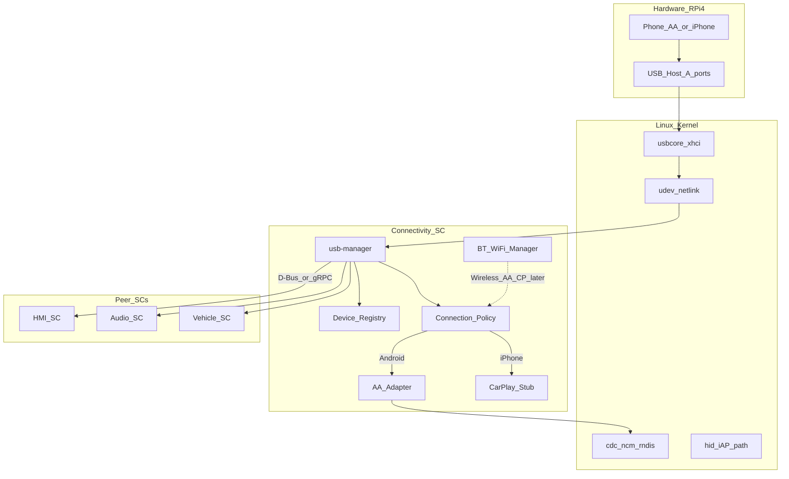
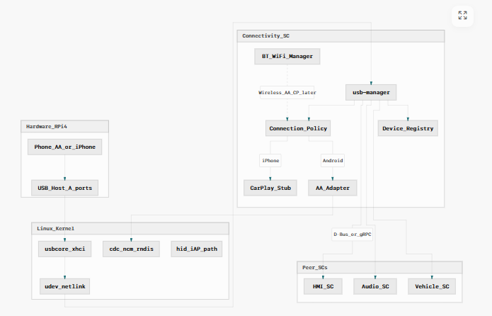
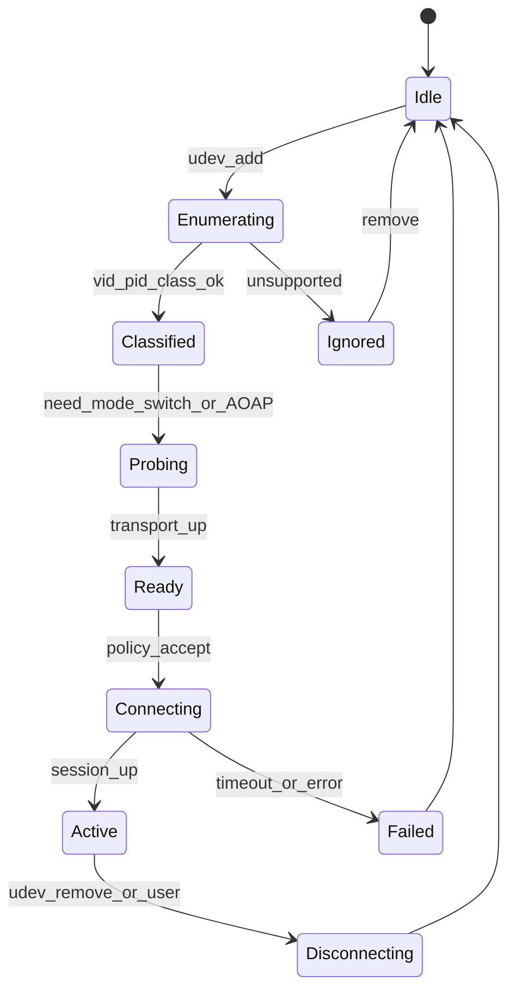
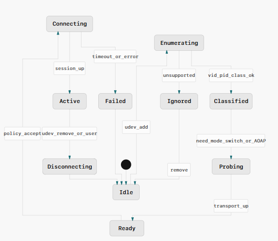

# Design: USB Manager (RPi4 Host) — Connectivity SC Prototype

## Bối cảnh đã chốt

- **Mục tiêu:** học / prototype trên Raspberry Pi 4 + Yocto
- **Vai trò USB:** **Host** (cắm phone vào USB-A)
- **AA:** dùng stack open-source (AASDK / OpenAuto-class)
- **CarPlay:** **stub + contract** (không implement full — cần Apple MFi / licensed stack)

---

## 1. Vị trí trong Connectivity SC

`usb-manager` là **component lõi** của Connectivity System Component: phát hiện thiết bị, phân loại, điều phối session projection, không tự render UI/audio.





**Ranh giới trách nhiệm**


| Component      | Làm gì                                                    | Không làm                         |
| -------------- | --------------------------------------------------------- | --------------------------------- |
| `usb-manager`  | hotplug, classify, session lifecycle, power policy cơ bản | decode video, play audio, draw UI |
| `AA_Adapter`   | AOAP/NCM + AASDK session                                  | HMI layout                        |
| `CarPlay_Stub` | detect iPhone, emit `CP_UNSUPPORTED` / future hook        | iAP2/MFi thật                     |
| HMI / Audio    | hiển thị / route media                                    | enumerate USB                     |


---

## 2. Kiến trúc phần mềm đề xuất

### 2.1 Layering

```text
+--------------------------------------------------+
|  IPC API (D-Bus recommended for Yocto IVI)       |
|  org.example.connectivity.Usb1                     |
+--------------------------------------------------+
|  Session Orchestrator (state machine)            |
+--------------------------------------------------+
|  Device Classifier | Policy Engine | Power Mgmt  |
+--------------------------------------------------+
|  Hotplug Monitor (libudev) | Transport adapters  |
+--------------------------------------------------+
|  Kernel: usbcore, cdc_ncm, rndis, hid, storage   |
+--------------------------------------------------+
```

**Khuyến nghị stack prototype**

- Language: **C++17** (phổ biến IVI) hoặc **Rust** nếu team quen — mặc định plan dùng **C++**
- Hotplug: **libudev** (systemd)
- USB userspace (khi cần control transfer / AOAP): **libusb-1.0**
- IPC: **sd-bus** / **sdbus-c++** (D-Bus)
- Build: CMake app + BitBake recipe trong meta layer riêng
- Logging: journald

### 2.2 Device lifecycle (state machine)





**Sự kiện chính**

- `DeviceAdded` / `DeviceRemoved` (udev)
- `Classified(type)` — `Android`, `iPhone`, `MassStorage`, `HID`, `Unknown`
- `SessionStart(req)` / `SessionStop` (từ HMI hoặc auto-policy)
- `TransportReady` (NCM iface up, AOAP channel open)

### 2.3 Classification heuristic (Host)

1. Đọc `ID_VENDOR_ID`, `ID_MODEL_ID`, `ID_USB_INTERFACES`, serial từ udev
2. Match bảng:
  - Apple VID `05ac` → candidate CarPlay / iAP (stub)
  - Android thường: MTP/ADB/accessory — sau probe AOAP hoặc NCM
3. Optional: `usb_modeswitch` nếu device ở mode storage trước
4. Ghi vào **Device Registry** (in-memory + optional persist allowlist)

### 2.4 Android Auto path (học được, open-source)

Luồng wired điển hình trên HU Host:

1. Phone enumerate
2. (Tuỳ device) chuyển sang **AOAP** (Android Open Accessory) hoặc dùng **NCM/RNDIS** + discovery
3. `AA_Adapter` mở session qua **AASDK**
4. Video → surface/wayland (HMI); Audio → Audio SC; Input ← HMI

**Prototype scope hợp lý**

- Phase 1: hotplug + classify + D-Bus events
- Phase 2: bring-up network iface / AOAP detect
- Phase 3: integrate OpenAuto/AASDK demo video pipeline (minimal)
- Phase 4: policy (auto-connect, exclusive session, reject khi đang call, …)

### 2.5 CarPlay path (stub)

```text
iPhone plugged
  -> classify Apple
  -> CarPlay_Stub.publish(Available=false, Reason=MFI_REQUIRED)
  -> HMI show "CarPlay not available in prototype"
  -> keep hooks: ICarPlayStack { start(); stop(); }
```

Document rõ dependency production: **Apple MFi auth coprocessor + licensed CarPlay stack + IAP2**.

### 2.6 Các tính năng Connectivity SC thường có (bạn “không nhớ”)

Nên đặt **interface sẵn**, implement dần:

- USB mass storage mount/unmount (udisks2 hoặc tự mount policy)
- Charging-only vs data (nếu HW hỗ trợ data line control — trên RPi thường chỉ data)
- Wireless AA / wireless CarPlay (phụ thuộc BT + Wi‑Fi SoftAP — phase sau)
- BT phone projection / HFP/A2DP (module `bt-manager` sibling)
- Wi‑Fi STA/AP cho wireless projection
- Device allowlist / last-connected
- Exclusive session: chỉ 1 projection active
- Health: reconnect, brownout, hub reset

---

## 3. IPC contract (D-Bus sketch)

```
Interface: org.example.connectivity.Usb1
Methods:
  ListDevices() -> a{sv}
  StartSession(device_id, mode)  // mode: "android_auto" | "carplay" | "storage"
  StopSession(device_id)
Signals:
  DeviceChanged(device_id, state, type)
  SessionChanged(device_id, session_state, reason)
Properties:
  ActiveSession
```

HMI chỉ subscribe signals; không đụng libudev trực tiếp.

---

## 4. Yocto integration (RPi4 Host)

**Kernel / MACHINE**

- Machine: `raspberrypi4-64` (meta-raspberrypi)
- Đảm bảo host controller bật (`xhci`), **không** ép gadget trên USB-A
- Modules hữu ích: `cdc_ncm`, `rndis_host`, `usbserial`, `usb-storage`

**Userspace packages (IMAGE_INSTALL)**

- `udev` / systemd
- `libusb1`, `libudev`
- `usbutils` (lsusb — debug)
- `usb-modeswitch` (optional)
- App recipe: `usb-manager`, `aa-adapter` (sau)

**Cấu trúc meta layer gợi ý**

```text
meta-connectivity/
  recipes-connectivity/usb-manager/
  recipes-connectivity/aa-adapter/
  recipes-core/images/…
  recipes-kernel/linux/… (cfg fragments nếu cần)
```

**udev rule ví dụ**

- Tag Android/Apple devices → `ENV{CONNECTIVITY_ROLE}=phone`
- Chạy helper hoặc để daemon listen netlink (ưu tiên daemon, rule chỉ tag)

---

## 5. Cấu trúc code prototype đề xuất

```text
usb-manager/
  src/
    main.cpp
    hotplug/UdevMonitor.cpp
    classify/DeviceClassifier.cpp
    registry/DeviceRegistry.cpp
    session/SessionOrchestrator.cpp
    policy/ConnectionPolicy.cpp
    ipc/UsbDbusService.cpp
    adapters/IProjectionAdapter.hpp
    adapters/AndroidAutoAdapter.cpp   // wraps AASDK later
    adapters/CarPlayStubAdapter.cpp
  include/
  systemd/usb-manager.service
  CMakeLists.txt
```

---

## 6. Thư viện & implementation để học

### USB / hotplug (bắt buộc học trước)


| Tài nguyên                                                                                   | Dùng để học                  |
| -------------------------------------------------------------------------------------------- | ---------------------------- |
| [libudev](https://www.freedesktop.org/software/systemd/man/libudev.html) + `udevadm monitor` | plug/unplug events           |
| [libusb](https://libusb.info/)                                                               | control/bulk transfers, AOAP |
| Kernel docs: USB, `cdc_ncm`, gadget vs host                                                  | phân biệt Host/Gadget        |
| `usb_modeswitch`                                                                             | Android mode switch          |


### Android Auto (open-source)


| Project                                       | Ghi chú                                    |
| --------------------------------------------- | ------------------------------------------ |
| [OpenAuto](https://github.com/f1xpl/openauto) | HU-side AA player (tham chiếu kiến trúc)   |
| [AASDK](https://github.com/f1xpl/aasdk)       | Protocol/session library — **core để học** |
| Crankshaft / OpenAuto forks trên Pi           | Bring-up thực tế trên RPi                  |
| Android AOAP docs (Android Open Accessory)    | Hiểu phase enumerate → accessory           |


### CarPlay (học concept, không full OSS)


| Tài nguyên                                                 | Ghi chú            |
| ---------------------------------------------------------- | ------------------ |
| Apple MFi / CarPlay accessories docs (NDA)                 | Production only    |
| Public overviews: iAP2, USB NCM role, Bonjour for wireless | Hiểu pipeline      |
| Stub adapter trong design này                              | Đủ cho prototype A |


### IPC / IVI patterns


| Tài nguyên                                     | Ghi chú                   |
| ---------------------------------------------- | ------------------------- |
| sdbus-c++ / sd-bus                             | Service API               |
| Automotive Grade Linux (AGL) connectivity docs | Tham chiếu SC tách domain |
| GENIVI / COVESA patterns                       | Lifecycle, diagnostics    |


### Yocto / RPi


| Tài nguyên                                         | Ghi chú         |
| -------------------------------------------------- | --------------- |
| Yocto Mega Manual — layers, recipes, PACKAGECONFIG | Đóng gói daemon |
| meta-raspberrypi                                   | Machine RPi4    |
| meta-openembedded (libusb, …)                      | Dependencies    |


---

## 7. Lộ trình học / deliverable theo phase

1. **P0 — Lab Host:** `udevadm` + chương trình C++ in ra add/remove + classify VID/PID
2. **P1 — usb-manager skeleton:** registry + state machine + D-Bus signals
3. **P2 — AA detect:** nhận diện Android + thử AOAP/NCM (log iface)
4. **P3 — AA session demo:** gắn AASDK/OpenAuto minimal (video/window)
5. **P4 — CarPlay stub + policy:** exclusive session, allowlist
6. **P5 — Yocto recipe + systemd** đưa vào image RPi4

---

## 8. Rủi ro kỹ thuật cần nhớ sớm

- **RPi4 USB power:** hub/phone có thể thiếu dòng — dùng PSU đủ công suất / powered hub
- **AOAP vs NCM:** từng phone/OEM khác nhau — classifier phải probe, không hardcode một path
- **CarPlay không clone được hợp pháp** không MFi — stub là đúng hướng cho mục tiêu A
- **Latency / realtime:** projection video/audio nên tách process với usb-manager (orchestrator mỏng)

---

## Quyết định đã chọn trong plan

- USB **Host**, prototype **học**, IPC **D-Bus**, ngôn ngữ **C++**, AA qua **AASDK/OpenAuto**, CarPlay **stub có interface**.

