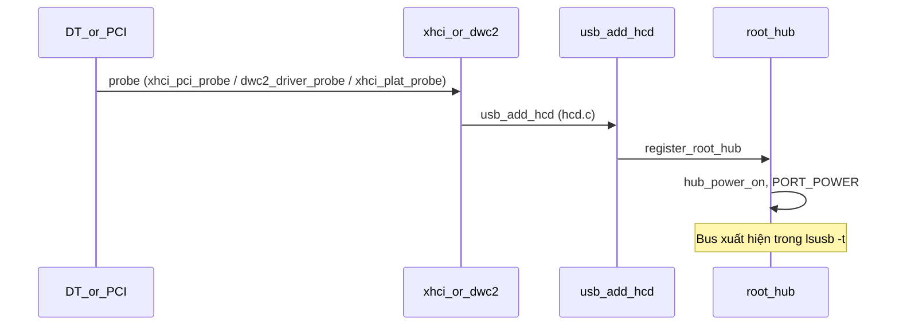
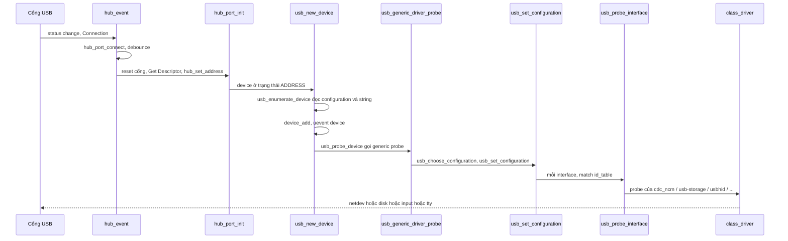
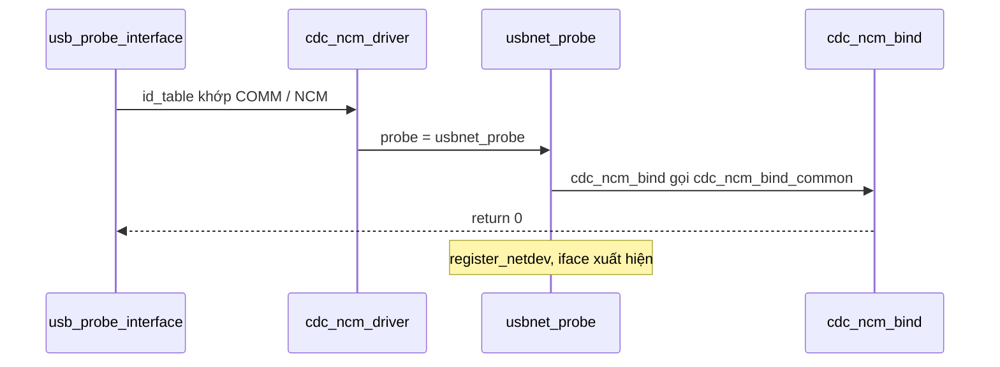
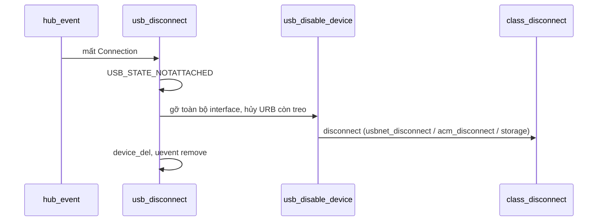
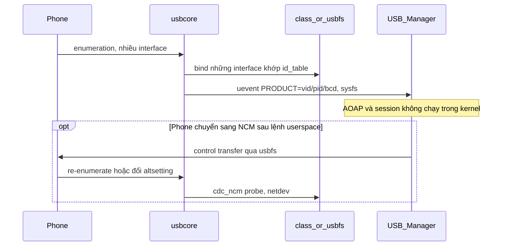
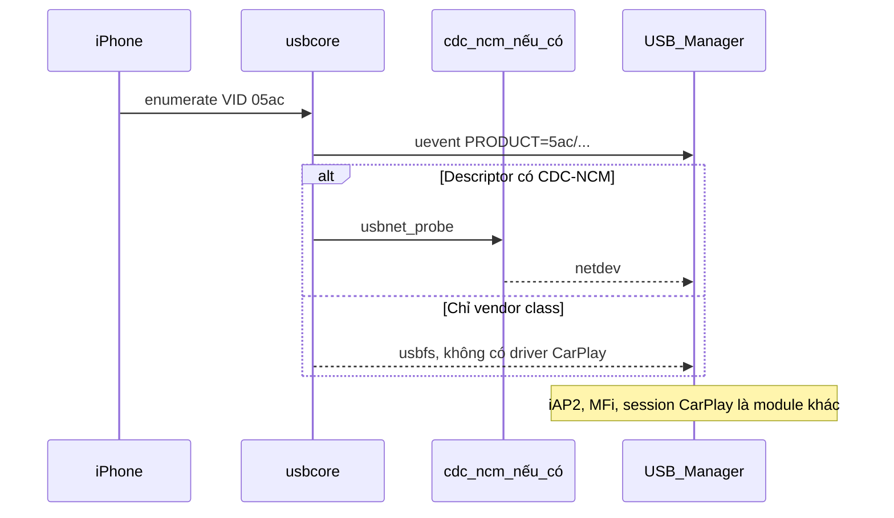
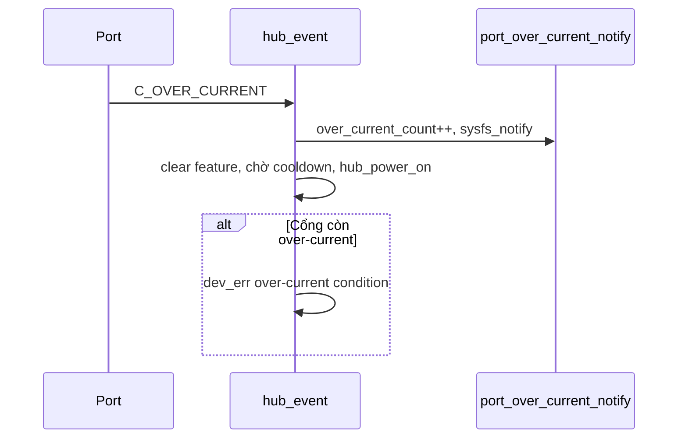

# USB-driver — source chuẩn Linux, sequence, biên module, test

Tài liệu này mô tả USB Host stack mà module USB-driver dùng. Kế hoạch ASPICE đi kèm: [ASPICE-PLAN.md](ASPICE-PLAN.md). ID yêu cầu `USBDRV-REQ-xxx` lấy từ kế hoạch đó.

Baseline trích hàm và số dòng: **Linux v6.18** (tag `v6.18`). Số dòng sẽ lệch nếu image Yocto build một revision khác. Khi pin kernel image, đối chiếu lại tên hàm; đừng khóa review vào số dòng.

Thuật ngữ USB trong tài liệu này nằm ở [mục 16](#16-thuật-ngữ-usb). Thuật ngữ ASPICE nằm ở [ASPICE-PLAN.md, mục 16](ASPICE-PLAN.md#16-thuật-ngữ-aspice).

## 1. Lấy source để đọc

Clone ngoài repo sản phẩm. Kernel đi theo Yocto, không copy `drivers/usb` vào cây Meter.

```bash
git clone --depth 1 --branch v6.18 --filter=blob:none --sparse \
  https://github.com/torvalds/linux.git ~/src/linux-v6.18
cd ~/src/linux-v6.18
git sparse-checkout set \
  drivers/usb \
  drivers/net/usb \
  drivers/hid/usbhid \
  Documentation/usb \
  Documentation/driver-api/usb \
  include/linux/usb
git checkout v6.18 -- include/linux/usb.h
```

Thứ tự đọc khi mới vào: mục 6 (enumeration) trước, rồi một class driver (NCM), rồi HCD của đúng board. Không đọc `drivers/usb/gadget` cho feature USB-A Host.

## 2. Việc của từng tầng

Trên đường Host, một URB (USB Request Block) do class driver tạo, usbcore kiểm tra và xếp, HCD đẩy xuống IP USB.

| Tầng | Việc | Chỗ đọc (v6.18) |
|---|---|---|
| HCD | Probe IP, đăng ký bus, phục vụ URB và hub control | Pi 4: `drivers/usb/host/xhci-pci.c` `xhci_pci_probe` (khoảng dòng 699). Pi 3: `drivers/usb/dwc2/platform.c` `dwc2_driver_probe` (khoảng dòng 439). Platform xHCI: `drivers/usb/host/xhci-plat.c` `xhci_plat_probe` (khoảng dòng 156) |
| Đăng ký root hub | HCD gọi vào core sau probe | `drivers/usb/core/hcd.c` `usb_add_hcd` (khoảng dòng 2808), `register_root_hub` (khoảng dòng 955) |
| Hub / enumeration | VBUS cổng, debounce, reset, địa chỉ, descriptor | `drivers/usb/core/hub.c` |
| Message / config | Control transfer, chọn và set configuration | `drivers/usb/core/message.c` `usb_control_msg`, `usb_set_configuration`; `drivers/usb/core/generic.c` `usb_generic_driver_probe` |
| Match driver | So `id_table`, gọi probe/disconnect của class driver | `drivers/usb/core/driver.c` |
| Class driver | Tạo netdev, disk, tty, input | bảng mục 3 |
| Song song lên userspace | uevent, sysfs, `/dev/bus/usb` | `usb_uevent` trong `driver.c`; `device_add` trong `usb_new_device` |

Fragment image đang bật các symbol sau (`usbManager/meta-connectivity/recipes-kernel/linux/files/connectivity-usb.cfg`): `USB`, `USB_XHCI_HCD`, `USB_XHCI_PCI`, `USB_STORAGE`, `USB_ACM`, `USB_SERIAL`, `USB_USBNET`, `USB_NET_CDCETHER`, `USB_NET_CDC_NCM`, `USB_NET_RNDIS_HOST`, `USB_HID`.

`CONFIG_USB_XHCI_PCI` khớp Pi 4 (VL805 trên PCIe). Pi 3 vẫn cần DWC2 từ machine config. Pi 5 cần xác nhận bằng `lsusb -t` xem bus nào xuất hiện; fragment PCI một mình không mô tả RP1.

## 3. Module kernel cần biết cho feature này

| Config | Module / driver | File | Hàm vào | Kết quả nhìn thấy |
|---|---|---|---|---|
| `USB_XHCI_HCD` + `USB_XHCI_PCI` | `xhci_hcd` | `drivers/usb/host/xhci.c`, `xhci-pci.c`, `xhci-ring.c`, `xhci-hub.c` | `xhci_pci_probe`, URB: `xhci_urb_enqueue` | bus USB 3 trên Pi 4 |
| `USB_DWC2` (machine Pi 3, không nằm trong fragment) | `dwc2` | `drivers/usb/dwc2/platform.c` | `dwc2_driver_probe` | bus USB 2 trên Pi 3 |
| built-in core | `usbcore` | `drivers/usb/core/` | `hub_event`, `usb_new_device` | mọi thiết bị |
| `USB_STORAGE` | `usb-storage` | `drivers/usb/storage/usb.c` | `storage_probe` khoảng dòng 1194, `usb_stor_probe1` khoảng dòng 1018 | `/dev/sd*` |
| `USB_NET_CDC_NCM` | `cdc_ncm` | `drivers/net/usb/cdc_ncm.c` | `usbnet_probe` rồi `cdc_ncm_bind` khoảng dòng 1067 | netdev, class comm subclass NCM |
| `USB_NET_CDCETHER` | `cdc_ether` | `drivers/net/usb/cdc_ether.c` | qua `usbnet` | netdev CDC ECM |
| `USB_NET_RNDIS_HOST` | `rndis_host` | `drivers/net/usb/rndis_host.c` | `usbnet_probe`, `rndis_bind` khoảng dòng 459 | netdev RNDIS |
| khung chung net | `usbnet` | `drivers/net/usb/usbnet.c` | `usbnet_probe` khoảng dòng 1705 | dùng chung cho NCM/RNDIS/ECM |
| `USB_ACM` | `cdc-acm` | `drivers/usb/class/cdc-acm.c` | `acm_probe` khoảng dòng 1182 | `/dev/ttyACM*` |
| `USB_SERIAL` | `usbserial` | `drivers/usb/serial/` | probe theo chip (chọn khi đọc máy cụ thể) | `/dev/ttyUSB*` |
| `USB_HID` | `usbhid` | `drivers/hid/usbhid/` | probe HID | input / hidraw |
| usbfs | trong usbcore | `drivers/usb/core/devio.c` | node `/dev/bus/usb` | libusb |

`drivers/net/usb/ipheth.c` là driver tether iPhone (class vendor `255/253/1`, VID Apple `0x05ac`), tên module `ipheth`. File này **không** phải driver CarPlay, và **không** nằm trong fragment hiện tại. Chỉ đọc khi một máy Apple thực sự bind nhầm hoặc khi trace “vì sao có iface `iph`”.

Không có file `carplay` hay `android_auto` trong tree chuẩn.

## 4. Hai cấu trúc nối class driver với usbcore

Hợp đồng nằm ở `include/linux/usb.h`, `struct usb_driver` khoảng dòng 1238 (v6.18).

Callback class driver phải có:

| Trường | Khi nào usbcore gọi |
|---|---|
| `name` | Tên trong sysfs và log |
| `id_table` | So với interface. Ví dụ `cdc_ncm` khớp `USB_INTERFACE_INFO(USB_CLASS_COMM, USB_CDC_SUBCLASS_NCM, USB_CDC_PROTO_NONE)` khoảng dòng 2107 `cdc_ncm.c` |
| `probe` | Sau khi match. Trả 0 nếu nhận interface |
| `disconnect` | Khi rút thiết bị hoặc unbind |
| `suspend` / `resume` / `reset_resume` | Power management và reset cổng |
| `pre_reset` / `post_reset` | Xung quanh reset do `usbcore` |
| `supports_autosuspend` | Cho phép autosuspend. `cdc_ncm` đặt 1 |

Class driver đăng ký bằng `module_usb_driver()` hoặc `usb_register_driver()`. `usb_register_driver()` (`driver.c` khoảng dòng 1060) gán `probe` của device model thành `usb_probe_interface` và `remove` thành `usb_unbind_interface`. Class driver không tự gắn vào bus.

URB: class driver gọi `usb_submit_urb()` (`drivers/usb/core/urb.c` khoảng dòng 368). HCD thực thi. Callback complete chạy về class driver. `usb_submit_urb` là lối duy nhất từ driver xuống controller; không có API thứ hai cho Android Auto.

## 5. Sequence — bật Host controller



Đọc: `xhci_pci_probe` hoặc `dwc2_driver_probe` tùy board, rồi `usb_add_hcd` trong `drivers/usb/core/hcd.c`.

## 6. Sequence — cắm thiết bị (enumeration)

Đây là sequence chính của module.



Hàm, file `drivers/usb/core/hub.c` trừ khi ghi khác, Linux v6.18:

| Bước | Hàm | Dòng khoảng |
|---|---|---|
| Workqueue cổng | `hub_event` | 5873 |
| Có connection | `hub_port_connect` | 5389 |
| Reset, đọc device descriptor, cấp địa chỉ | `hub_port_init` | 4901 |
| Set address | `hub_set_address` | 4746 |
| Đọc configuration, manufacturer/product/serial | `usb_enumerate_device` | 2520 |
| Đưa device lên driver model, tạo số usbfs | `usb_new_device` | 2641. `device_add` khoảng 2694. `udev->dev.devt` usbfs khoảng 2671 |
| Chọn configuration và đăng ký interface | `usb_generic_driver_probe` | `generic.c` 238 |
| Set configuration | `usb_set_configuration` | `message.c` 1996 |
| Khớp và gọi probe | `usb_probe_interface` | `driver.c` 318 |
| Điền `PRODUCT`, `TYPE` cho udev | `usb_uevent` | `driver.c` 915 |

`usb_new_device` chỉ được hub driver gọi. Device lúc này đã có địa chỉ; configuration chưa set. Comment trong source nói rõ sysfs chưa visible trước `device_add`.

Match interface: `usb_probe_interface` lấy `usb_match_id(intf, driver->id_table)`. Không khớp thì probe của driver đó không chạy. Một thiết bị nhiều interface có thể gắn nhiều class driver cùng lúc (ví dụ comm NCM và interface vendor khác).

## 7. Sequence — bind CDC-NCM

Điện thoại đã expose CDC-NCM (sau khi bản thân nó ở mode mạng). Bước đổi mode sang accessory, nếu có, nằm ở userspace trước sequence này.



Đọc `drivers/net/usb/cdc_ncm.c`: `cdc_ncm_driver` khoảng dòng 2117 (`name = "cdc_ncm"`, `probe = usbnet_probe`, `id_table = cdc_devs`). `cdc_ncm_bind` khoảng dòng 1067. Khung URB và netdev nằm ở `usbnet_probe` trong `drivers/net/usb/usbnet.c` khoảng dòng 1705.

RNDIS cùng khuôn: `rndis_driver` khoảng dòng 677 `rndis_host.c`, `probe = usbnet_probe`, `bind = rndis_bind` khoảng dòng 459.

Mass storage: `storage_probe` trong `drivers/usb/storage/usb.c` khoảng dòng 1194. CDC-ACM: `acm_probe` trong `drivers/usb/class/cdc-acm.c` khoảng dòng 1182.

## 8. Sequence — rút cáp



Đọc `usb_disconnect` trong `hub.c` khoảng dòng 2314. Hàm đặt trạng thái `NOTATTACHED` trước, để `usb_submit_urb` mới thất bại ngay, rồi mới unbind. Class driver giải phóng netdev, disk, tty trong `disconnect` của chính nó. Ví dụ `usbnet_disconnect` khoảng dòng 1639 `usbnet.c`, `acm_disconnect` khoảng dòng 1572 `cdc-acm.c`.

## 9. Android Auto trên biên USB-driver

Kernel không chạy protocol Android Auto. Việc kernel làm là Host enumeration và class driver. Phần AOAP (Android Open Accessory), session, video, audio thuộc USB-Manager và thư viện phía trên.

Điện thoại cắm vào cổng Host thường rơi vào một trong các hình sau. Hình nào xuất hiện phụ thuộc firmware điện thoại, không phụ thuộc HCD.

| Hình trên dây | Driver kernel nếu config đã bật | Việc còn lại ở ngoài USB-driver |
|---|---|---|
| MTP / PTP / storage | `usb-storage` hoặc không bind nếu class vendor | Manager đọc `bInterfaceClass` |
| ADB | `usbserial` chỉ khi id khớp bảng serial; thường userspace tự claim qua usbfs | Không bắt kernel tạo tty cho ADB |
| CDC-NCM hoặc CDC-ECM | `cdc_ncm`, `cdc_ether` | Stack mạng userspace |
| RNDIS | `rndis_host` | Stack mạng userspace |
| Vendor-specific, accessory | Không có class driver standard nào nhận. usbfs để libusb gửi control request AOAP | Mode switch nằm ở USB-Manager |

Sequence đúng chỗ cho module này khi cắm máy Android:



Tiêu chí USB-driver cho điện thoại Android là REQ-014: liệt kê được interface. Tiêu chí “có netdev” chỉ đúng khi class NCM/RNDIS đã xuất hiện trên descriptor. Một điện thoại chỉ có interface vendor vẫn là enumerate thành công.

## 10. CarPlay trên biên USB-driver

Kernel mainline không chứa stack CarPlay, iAP2, hay xác thực MFi. CarPlay dây sau này cần accessory MFi và stack có bản quyền, nằm ngoài module. `ipheth` là tether cá nhân, xem mục 3.

Việc USB-driver làm với thiết bị Apple (VID `05ac`):

| Việc | Ở đâu |
|---|---|
| Cấp địa chỉ, đọc descriptor, đưa sysfs và uevent | `usbcore`, giống mọi device |
| Nếu iPhone expose CDC-NCM | `cdc_ncm` tạo netdev |
| Nếu chỉ có vendor interface | không bind CarPlay. usbfs để layer trên gửi request của họ |
| Nguồn VBUS cho cổng | hub driver, mục 11 |



Tiêu chí USB-driver là REQ-015: VID `05ac` xuất hiện và interface đúng với descriptor. Không dùng trạng thái “CarPlay đang chiếu” để pass test module này.

## 11. Nguồn (power)

Ba lớp nguồn khác nhau. Chỉ lớp hub thuộc USB-driver standard. Hai lớp kia chờ schematic EVB.

| Lớp | Cơ chế | Trong Linux v6.18 | Trên Pi |
|---|---|---|---|
| VBUS cổng hub | Set/clear feature `PORT_POWER` | `usb_hub_set_port_power` `hub.c` khoảng dòng 890 | Root hub bật nguồn khi hub lên |
| Quá dòng | Cổng báo over-current, đếm, uevent change, hub bật lại nguồn sau cooldown | `port_over_current_notify` khoảng dòng 5711, xử lý trong `hub_event` khoảng dòng 5788–5799 | Cổng Pi ít khi cho phép test chủ động quá dòng |
| Autosuspend | Tiết kiệm khi device idle | `usb_new_device` gọi `pm_runtime_use_autosuspend` rồi `usb_disable_autosuspend` mặc định, khoảng dòng 2656–2662 | Phụ thuộc class driver có `supports_autosuspend` |
| Sạc / charge-only / data switch | Phần cứng Meter và policy userspace | Không có trong `usbcore` | Pi không có công tắc data line của đồng hồ |

Sequence quá dòng, khi phần cứng thực sự báo:



REQ nguồn có thể viết ngay cho `PORT_POWER` và log quá dòng. REQ charge-only để mở đến khi có sơ đồ EVB (`USBDRV-REQ-018` trong kế hoạch).

## 12. Giao tiếp usb-driver và usb-kernel

Trong source, “usb-driver” là `struct usb_driver` (class hoặc vendor driver). “usb-kernel” ở đây là usbcore cộng HCD: hub, device model, URB, controller.

Chiều gọi:

```text
class driver                         usbcore                         HCD
--------------                       -------                         ---
usb_register_driver        -->       usb_probe_interface
id_table                            usb_match_id
probe / disconnect         <--       gọi khi bind / rút
usb_submit_urb             -->       kiểm tra URB          -->       enqueue (xhci_urb_enqueue / dwc2)
complete callback          <--       hoàn URB              <--       ngắt controller
usb_control_msg            -->       usb_control_msg (message.c)
autosuspend flag           -->       pm_runtime
```

Quy tắc khi đọc code, tránh lẫn với USB-Manager:

| Hướng | API | Ai gọi |
|---|---|---|
| Driver vào core | `usb_submit_urb`, `usb_control_msg`, `usb_register_driver`, `usb_fill_bulk_urb` | Class driver |
| Core vào driver | `probe`, `disconnect`, `suspend`, `resume`, `pre_reset`, `post_reset` | `usb_probe_interface`, `usb_unbind_interface` |
| Core vào HCD | các hàm trong `struct hc_driver` qua `usb_hcd` | `hcd.c` |
| HCD vào core | `usb_add_hcd`, complete URB, hub status | cuối probe của xhci/dwc2 |
| Kernel ra userspace | uevent, sysfs, usbfs, netdev, block, tty | không phải lệnh gọi hàm của Manager vào HCD |

Userspace không gọi `usb_submit_urb`. libusb đi qua usbfs (`devio.c`), rồi cũng vào URB trong core. Đó là lý do AOAP viết ở USB-Manager vẫn chạy trên cùng stack, không cần một kernel module Android Auto.

Điểm gỡ lỗi khi “driver không nhận máy”:

1. `lsusb -v` xem `bInterfaceClass/SubClass/Protocol`.
2. So với `id_table` của driver (NCM: `cdc_devs` trong `cdc_ncm.c`).
3. Nếu class vendor và không có dòng trong `id_table`, usbcore để interface unbound và usbfs claim được. Đây là trạng thái bình thường của accessory, không phải lỗi HCD.
4. Nếu descriptor không đọc được, dừng ở `usb_enumerate_device` / `hub_port_init`, class driver chưa được gọi.

## 13. Biên với USB-Manager

Manager nhìn kernel qua các bề mặt sau. Bề mặt này là hợp đồng SWE.2.

| Bề mặt | Nội dung | Nguồn trong kernel |
|---|---|---|
| uevent | `add` / `remove`, `PRODUCT=vid/pid/bcd`, `TYPE=class/subclass/protocol` | `usb_uevent` |
| sysfs | `idVendor`, `idProduct`, `serial`, `bInterfaceClass`, `driver` | device model USB |
| usbfs | control, bulk, claim interface | `devio.c`, số minor cấp trong `usb_new_device` |
| netdev | iface sau NCM, ECM, RNDIS | `usbnet` |
| block / tty / hid | storage, ACM, serial, HID | class driver tương ứng |

Manager không branch theo tên HCD. Pi 3 và Pi 4 khác controller; cùng descriptor thì cùng `PRODUCT`.

## 14. Test case

Mức `SWE.5` là tích hợp stack trên board. Case đó được dùng lại cho `SWE.6` khi cùng tiêu chí với một REQ. Tiền điều kiện chung: image có fragment cfg, ghi `uname -r`, cổng USB-A, cấp nguồn đủ (phone nên qua hub có nguồn nếu Pi rớt bus).

| ID | REQ | Mức | Tiền điều kiện | Các bước | Kết quả đạt |
|---|---|---|---|---|---|
| TC-HCD-001 | REQ-001 | SWE.5, SWE.6 | Boot xong, chưa cắm phụ | `lsusb`, `lsusb -t` | Có ít nhất một bus. Pi 4 thấy controller xHCI. Pi 3 thấy bus DWC2. Ghi tên driver vào biên bản |
| TC-HOST-001 | REQ-013 | SWE.5, SWE.6 | Cùng cổng feature (USB-A) | Cắm storage vào USB-A. Trên Pi 4 không dùng cổng USB-C làm cổng test | Thiết bị nằm dưới Host controller của USB-A. Gadget không chiếm cổng đó |
| TC-ENUM-001 | REQ-002, REQ-017 | SWE.5, SWE.6 | Storage khỏe | Cắm, chờ 3 giây, `lsusb`, `dmesg \| tail`. Rút. Cắm một thiết bị hỏng hoặc chỉ cắm nửa chân nếu an toàn và đã từng fail; không cố tình làm hỏng cổng | VID/PID hiện. Sau rút, device number đó không còn. Nếu enumerate lỗi, log core có, sysfs không giữ node |
| TC-STORE-001 | REQ-003 | SWE.5, SWE.6 | USB mass storage | Cắm. `lsblk`. Đọc `driver` trong sysfs của interface | Có disk. Driver `usb-storage` |
| TC-NCM-001 | REQ-004 | SWE.5, SWE.6 | Điện thoại hoặc dongle đang ở CDC-NCM. Nếu phone chưa bật mode mạng, ghi precondition fail, không ghi fail driver | `lsusb -v` tìm subclass NCM. `ip link`. sysfs driver | `cdc_ncm` bound, có netdev |
| TC-RNDIS-001 | REQ-005 | SWE.5, SWE.6 | Thiết bị RNDIS | như TC-NCM-001 với driver `rndis_host` | `rndis_host` bound, có netdev |
| TC-ACM-001 | REQ-006 | SWE.5 | Thiết bị CDC-ACM hoặc USB-serial nếu có trong lab. Không bắt buộc phone | cắm, `ls /dev/ttyACM* /dev/ttyUSB*` | Đúng node với class đã khai báo. Không có thiết bị lab thì case blocked, không waive âm thầm |
| TC-HID-001 | REQ-007 | SWE.5, SWE.6 | USB mouse hoặc keyboard | cắm, `dmesg`, xem input | `usbhid` bound, thiết bị input hiện |
| TC-UEVENT-001 | REQ-008 | SWE.5, SWE.6 | `udevadm monitor -u -p` đang chạy | cắm storage, rút | Một uevent add và một remove, có `PRODUCT=` |
| TC-SYSFS-001 | REQ-009 | SWE.5, SWE.6 | Thiết bị có serial | đọc `idVendor`, `idProduct`, `serial` | Khớp `lsusb`. Serial trống chỉ khi descriptor không có iSerial, ghi vào biên bản |
| TC-USBFS-001 | REQ-010 | SWE.5, SWE.6 | Đã enumerate | `ls /dev/bus/usb` | Có node bus/device tương ứng |
| TC-UNPLUG-001 | REQ-011 | SWE.5, SWE.6 | Đang có disk hoặc netdev | rút khi device đã bind. Làm thêm một lần rút trong lúc `dmesg` còn đang enumerate | Disk/netdev/tty của device đó mất. Không còn child trong `lsusb -t` |
| TC-AA-001 | REQ-014 | SWE.6 | Máy Android, câp data | Cắm. Lưu `lsusb -v` ra file. Không cần mở Android Auto trên HMI | Có VID/PID. Bảng interface được lưu. Nếu chỉ thấy vendor class, kết quả vẫn đạt REQ-014, ghi “chưa có NCM” |
| TC-CP-001 | REQ-015 | SWE.6 | iPhone, câp data, đã trust máy nếu iOS hỏi | Cắm. `lsusb`. Lưu descriptor | VID `05ac`. Không assert session CarPlay. Ghi interface class thực tế |
| TC-DELTA-001 | REQ-016 | SWE.5, SWE.6 | Cùng một USB storage trên Pi 3, Pi 4, Pi 5 | Chạy TC-HCD-001 và TC-STORE-001 và TC-UEVENT-001 mỗi board | Class driver và `PRODUCT` cùng dạng. Tên HCD được phép khác và phải được ghi |
| TC-OC-001 | REQ-012 | SWE.6 | Cổng có báo quá dòng. Pi thường không tạo được điều kiện này | Đọc `over_current_count` khi sự kiện xảy ra | Count tăng hoặc log `over-current condition`. Nếu lab không kích được: waiver, trỏ `port_over_current_notify`, chạy lại trên EVB |
| TC-PWR-001 | quan sát IA, chưa phải REQ-018 | SWE.5 | Root hub đã lên | Đọc trạng thái cổng hub trong sysfs (`usb.../power` nếu có) | Cổng feature có điện vì thiết bị enumerate được. Không kết luận dòng sạc |

Case blocked (thiếu cáp, thiếu Pi, thiếu phone) ghi trong biên bản. Không chuyển thành pass.

Log nên giữ cho mỗi case: `uname -r`, board, `lsusb -t`, đoạn `dmesg` từ lúc cắm đến lúc bind hoặc lỗi, ảnh chụp sysfs driver.

## 15. Lối đọc một tuần

| Ngày | Đọc | Xong khi |
|---|---|---|
| 1 | Mục 2, 5, 6 tài liệu này. Song song `hub.c`: `hub_event`, `hub_port_connect`, `hub_port_init`, `usb_new_device` | Kể lại enumeration không cần mở file |
| 2 | `generic.c` `usb_generic_driver_probe`, `driver.c` `usb_probe_interface` và `usb_uevent`, `include/linux/usb.h` `struct usb_driver` | Chỉ được bảng mục 4 và 12 |
| 3 | `cdc_ncm.c` id_table + `usbnet_probe`. Một file storage `storage_probe` | Map được descriptor NCM sang netdev |
| 4 | HCD của đúng Pi đang ngồi: `xhci_pci_probe` hoặc `dwc2_driver_probe`. Dừng ở `usb_add_hcd` | Giải thích được TC-DELTA-001 |
| 5 | Mục 9, 10, 11. Chạy TC-STORE-001, TC-UEVENT-001, TC-UNPLUG-001 | Log lab cho IA |

`xhci-ring.c` để sau, khi một URB thất bại và log đã chỉ vào xHCI. Không đọc ring để viết SWE.1.

## 16. Thuật ngữ USB

Các mục dưới là nghĩa của từ khi đọc module USB-driver của dự án này. Định nghĩa đủ để đi tiếp sequence ở các mục trên.

### Vai trò trên cổng

| Thuật ngữ | Nghĩa trong module này |
|---|---|
| Host | Máy cấp vai trò chủ trên cổng: cấp địa chỉ, đọc descriptor, chạy driver. Pi khi cắm điện thoại vào USB-A đang là Host. Toàn bộ feature này theo hướng Host |
| Device | Phía bị Host điều khiển: điện thoại, USB stick, chuột. Trong kernel, một device USB là `struct usb_device` sau khi đã có địa chỉ |
| Gadget | Linux đóng vai device, để PC bên ngoài nhìn thấy Pi như một thiết bị. Cổng USB-C của Pi 4 có thể vào vai này. Cổng feature USB-A không dùng gadget |
| Hub | Thiết bị chia cổng USB. Kernel có hub driver trong `drivers/usb/core/hub.c` |
| Root hub | Hub ảo gắn thẳng vào Host controller. `lsusb -t` luôn có root hub khi HCD đã lên, kể cả khi chưa cắm gì |

### Khối phần mềm

| Thuật ngữ | Nghĩa trong module này |
|---|---|
| HCD (Host Controller Driver) | Driver của IP USB trên SoC hoặc chip rời. Nó biết thanh ghi, ngắt, và cách đẩy gói xuống dây. Pi 4 dùng xHCI. Pi 3 dùng DWC2. Class driver không gọi HCD trực tiếp |
| xHCI | Chuẩn Host controller của USB 3. Driver Linux là `xhci_hcd`. Trên Pi 4, chip VL805 nằm trên PCIe nên vào `xhci_pci_probe` |
| DWC2 | IP USB Synopsys DesignWare 2. Đây là Host controller của Raspberry Pi 3. Hàm vào là `dwc2_driver_probe` |
| usbcore | Phần giữa, không gắn một chip cụ thể: cấp địa chỉ, đọc descriptor, chọn configuration, match driver, sysfs, uevent. Nằm ở `drivers/usb/core/` |
| Class driver | Driver cho một loại chức năng USB (lưu trữ, mạng, bàn phím), không cho một SoC. Ví dụ `cdc_ncm`, `usb-storage`, `usbhid` |
| usbnet | Khung chung cho USB Ethernet trong `drivers/net/usb/usbnet.c`. `cdc_ncm` và `rndis_host` dùng chung `usbnet_probe`, rồi mới gọi `bind` riêng |

### Vòng đời thiết bị

| Thuật ngữ | Nghĩa trong module này |
|---|---|
| Enumeration | Chuỗi Host làm khi vừa cắm: reset cổng, đọc device descriptor, cấp địa chỉ, đọc configuration, set configuration. Xong enumeration thì device hiện trong `lsusb` |
| Descriptor | Bảng thiết bị tự khai. Device descriptor có VID/PID. Configuration descriptor mô tả các interface. Interface descriptor có class/subclass/protocol để match driver |
| VID / PID | Vendor ID và Product ID, mỗi số 16 bit. Apple là VID `05ac`. uevent đưa ra dưới biến `PRODUCT=vid/pid/bcd` |
| Configuration | Một cấu hình làm việc của device. usbcore chọn một configuration rồi gọi `usb_set_configuration`. Sau bước đó các interface mới được đăng ký |
| Interface | Một chức năng bên trong device. Một điện thoại có thể có interface MTP và interface vendor cùng lúc. Class driver bind theo interface, không theo cả cái điện thoại |
| Endpoint | Đầu ống truyền trên một interface. EP0 là endpoint control, lúc nào cũng có, dùng cho descriptor và lệnh setup. Bulk cho dữ liệu lớn (storage, NCM). Interrupt cho HID và trạng thái |
| altsetting | Một interface có thể có vài cách bố trí endpoint. NCM đổi altsetting khi bật đường dữ liệu |
| probe | Hàm kernel gọi khi một driver đồng ý nhận device hoặc interface. Với HCD, probe chạy lúc boot vì controller xuất hiện. Với class driver, probe chạy sau khi `id_table` khớp, bên trong `usb_probe_interface`. Trả 0 nghĩa là nhận, khác 0 nghĩa là từ chối |
| bind | Trạng thái “driver này đang giữ interface này”. Trong sysfs, file `driver` trỏ tới `cdc_ncm` hoặc `usb-storage` khi bind xong |
| id_table | Bảng để usbcore biết driver nhận interface nào. `cdc_ncm` khớp class communication, subclass NCM. Không có dòng khớp thì probe không được gọi |
| disconnect | Callback class driver khi interface bị gỡ vì rút cáp hoặc unbind. Driver trả netdev, disk, tty tại đây |
| unbind | Gỡ quan hệ driver với interface. Rút cáp đi qua `usb_disconnect` rồi gọi disconnect của class driver |

### Gói và đường truyền

| Thuật ngữ | Nghĩa trong module này |
|---|---|
| URB (USB Request Block) | Một yêu cầu I/O mà class driver đưa cho usbcore. usbcore kiểm tra rồi HCD thực hiện. Xong việc, callback complete chạy lại class driver. `usb_submit_urb` là lối đó |
| Control transfer | Trao đổi ngắn trên EP0: đọc descriptor, set address, lệnh vendor. libusb gửi control transfer qua usbfs |
| Bulk transfer | Luồng dữ liệu lớn, dùng cho storage và thân gói NCM/RNDIS |

### Các class hay gặp

| Thuật ngữ | Nghĩa trong module này |
|---|---|
| CDC | Communications Device Class. Nhóm chuẩn USB cho modem và mạng. NCM, ECM, ACM đều nằm trong CDC |
| NCM (CDC-NCM) | Network Control Model: Ethernet trên USB, nhiều khung gói trong một transfer. Driver `cdc_ncm`. Android Auto và một số đường CarPlay dùng interface này khi điện thoại đã ở mode mạng. Chưa ở mode mạng thì kernel không có NCM để bind |
| ECM (CDC-ECM) | Ethernet Control Model, đời trước NCM, một khung Ethernet một transfer. Driver `cdc_ether`, config `USB_NET_CDCETHER` |
| RNDIS | Remote NDIS, giao thức mạng USB của Microsoft. Nhiều máy Android cũ hiện RNDIS thay vì NCM. Driver `rndis_host` |
| ACM (CDC-ACM) | Abstract Control Model: cổng serial ảo. Driver `cdc-acm` tạo `/dev/ttyACM*` |
| HID | Human Interface Device: bàn phím, chuột, một số đường điều khiển. Driver `usbhid` |
| Mass storage | Class đĩa. Driver `usb-storage` tạo block device |
| MTP | Media Transfer Protocol, hay gặp lúc điện thoại mới cắm. Có thể đi trên class storage hoặc vendor. USB-driver chỉ cần thấy interface, không giải mã MTP |
| Vendor class | Interface class `0xFF`. Không có driver chuẩn nào nhận nếu `id_table` không có VID/PID đó. usbfs vẫn mở được để USB-Manager gửi lệnh. AOAP thường ở dạng này |
| AOAP | Android Open Accessory: điện thoại đổi sang mode accessory sau vài control request. Request đó do USB-Manager gửi qua libusb. Kernel không có module tên AOAP |
| ipheth | Driver tether iPhone trong `drivers/net/usb/ipheth.c`, class vendor riêng, VID Apple. Không phải CarPlay, và fragment cấu hình hiện tại không bật nó |
| iAP2 / MFi | iPod Accessory Protocol và chip xác thực Apple. CarPlay thật cần chúng. Chúng nằm ngoài USB-driver |

### Nhìn từ userspace

| Thuật ngữ | Nghĩa trong module này |
|---|---|
| sysfs | Cây `/sys`. USB device nằm dưới `/sys/bus/usb/devices/`. `idVendor`, `idProduct`, `serial`, link `driver` đọc ở đây |
| uevent | Thông báo kernel khi device thêm hoặc mất. `usb_uevent` gắn `PRODUCT` và `TYPE`. USB-Manager nhận qua udev |
| udev | Daemon userspace đọc uevent. `udevadm monitor` là cách xem nóng lúc test |
| usbfs | Node `/dev/bus/usb/BUS/DEV` để userspace (libusb) nói chuyện USB mà không viết kernel module |
| netdev | Network interface trong kernel (`ip link`), xuất hiện sau khi `cdc_ncm` hoặc `rndis_host` probe thành công |
| `y` và `m` | Trong config kernel, `=y` build vào kernel, `=m` build thành module tải được. Fragment dự án để HCD là `y`, class driver mạng và storage là `m` |
| Device tree / `dr_mode` | Mô tả phần cứng cho kernel. `dr_mode = "host"` khóa cổng ở vai Host. Việc này thuộc phần config mình sở hữu khi có DTS của EVB |

### Nguồn

| Thuật ngữ | Nghĩa trong module này |
|---|---|
| VBUS | Dây cấp điện 5 V trên cổng USB. Có VBUS thì thiết bị mới enumerate |
| PORT_POWER | Feature của hub để bật hoặc cắt nguồn một cổng. Hàm `usb_hub_set_port_power` |
| Over-current | Cổng báo rút quá dòng. Hub tăng `over_current_count` và log. Lab Pi ít khi tạo được sự kiện này |
| Autosuspend | Kernel cho device ngủ khi rảnh để giảm dòng. Mặc định usbcore tắt autosuspend cho device mới. Class driver nào đặt `supports_autosuspend` mới được phép |
